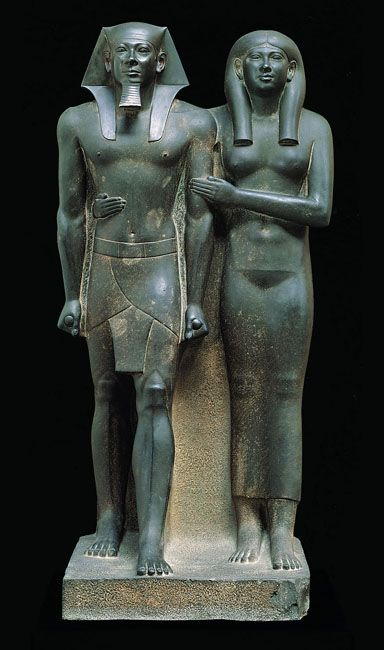

## 基本信息
- 作者：匿名
- 创作年代：古埃及第四王朝（约公元前 2500 年）
- 材质：石灰岩、闪长岩等，常见彩绘 (*not from wiki*)
- 现存地：埃及各大博物馆 (*not from wiki*)

## 画面与技法
- 严格的正面像：双脚并立、左脚略前、双手贴体或交叠
- 重量平均分布于双脚
- 程式化的 [[埃及人体程式 (21 等份) Egyptian canon]] 应用
- 数千年沿用同一造型，原因是埃及人认为"法老灵魂会寄居在雕像中，雕像应一模一样"

## 历史背景 (*not from wiki*)
本课作为对照点出现：与古希腊雕塑的"求异 / 个性化"形成根本观念差异。

## 图片清单

| 编号 | 出自 | 描述 |
|---|---|---|
| 01 | [[002｜古希腊雕塑：为什么做得这么逼真？]] | 埃及第四王朝双人立像 |

<!-- src: https://piccdn3.umiwi.com/img/202103/10/202103101342481359051876.jpg -->

## 出现在
- [[002｜古希腊雕塑：为什么做得这么逼真？]]
