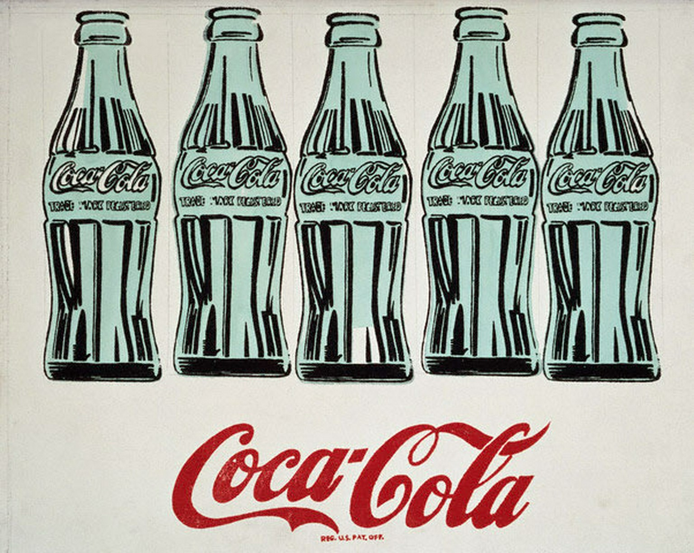

## 基本信息

- 作者：[[安迪·沃霍尔 Andy Warhol]]
- 创作年代：1958
- 材质：（*not from wiki*）布面油画 / 综合材料（早期作品，尚未完全转向丝网印刷）
- 尺寸：（*not from wiki*）信息不全
- 现存地：（*not from wiki*）信息不全

## 画面与技法

[[安迪·沃霍尔 Andy Warhol]] 早期尝试——以美国国民消费品**可口可乐**作为单独的画面对象。1958 还在他正式启用 [[丝网印刷 Silkscreen]] 之前（约 1962 起），但已经清晰显示出他的核心选材逻辑：**电视和超市里的爆款符号**就是他要画的东西。

顾衡 098 把这幅作品放在"安迪·沃霍尔搞的，才是真正的波普艺术"这一论断之下。

## 历史背景 (*not from wiki*)

- 1958 作品在沃霍尔自己的演化中处于过渡位置：他此时还以商业插画师为主业，《Coca-Cola Plan》是从插画跨向画廊的早期试水之一。

## 图片清单

| 编号 | 出自 | 描述 |
|---|---|---|
| 01 | [[098｜波普艺术：流行文化如何成为艺术？]] | 作品全图 |

## 出现在

- [[098｜波普艺术：流行文化如何成为艺术？]]
