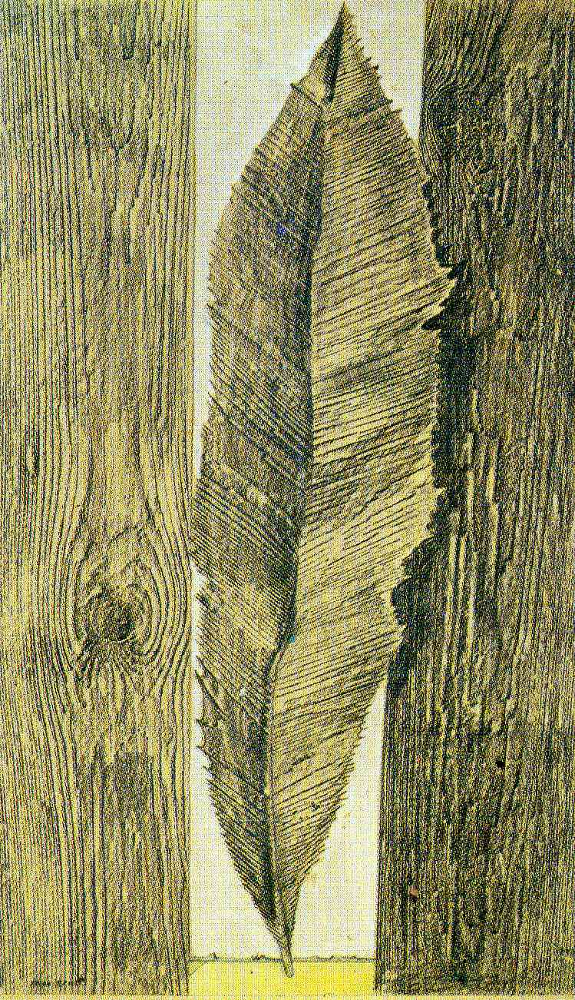

## 基本信息

- 作者：[[恩斯特 Max Ernst]]
- 创作年代：1925
- 材质：纸上铅笔摩擦（[[摩擦法 Frottage]]）/ 后期收入图册《Histoire naturelle》(*not from wiki*)
- 现存地：纽约 MoMA 等多家美术馆藏有同系列 (*not from wiki*)

## 画面与技法

本课用以**直接展示 [[摩擦法 Frottage]] 效果**的代表作。摩擦法：

> 把一张纸覆盖在木头或树叶上，用铅笔随意涂抹，纸下面物体的纹路就会呈现出来。

由此生成的图像**带有偶然性**，但艺术家在判断"取哪片树叶 / 哪块木头 / 取哪个位置 / 进一步发展成何种意象"时**理性 100% 在场**。这是恩斯特从 [[达达主义 Dadaism]] 偶然性遗产中**工具化**出的可控技法——离 [[自动写作 Automatic Writing]] 最近的绘画实践。

## 图片清单

| 编号 | 出自 | 描述 |
|---|---|---|
| 01 | [[093｜契里柯与恩斯特：如何用绘画表现超现实主义？]] | 摩擦法生成的树叶 / 植物纹理为基底，演化出鸟形或动物形象的轮廓 |

## 出现在

- [[093｜契里柯与恩斯特：如何用绘画表现超现实主义？]] — [[摩擦法 Frottage]] 代表作
