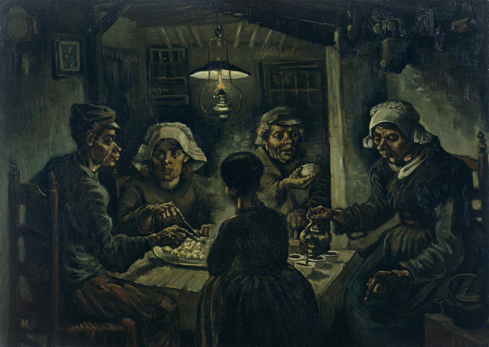

## 基本信息

- 作者：[[凡·高 Vincent van Gogh]]
- 创作年代：1885
- 材质：布面油画 (*not from wiki*)
- 尺寸：82 × 114 cm (*not from wiki*)
- 现存地：阿姆斯特丹凡·高博物馆 (*not from wiki*)

## 画面与技法

凡·高在荷兰纽南时期的代表作，五个农民围在油灯下吃土豆——他自评是当时画得最好的作品，专门做了版画分送朋友。

但在 057 中顾衡指出：

- **最右老妇人的手** "根本不可能拿住那个咖啡壶"——透视、造型崩坏；
- **她的屁股没挨着凳子**，扎个马步悬空——和凡·高自己当年在福音派学校的姿态一模一样；
- 凡·高的辩护："我不想使画中的人物真实……如果我的人物是准确的，我将感到绝望……他们比实实在在的真实更真实。"
- 顾衡定性：**素描、透视、造型这些基本功，对凡·高来说一直是没有解决的问题**——他用"不为"掩饰"不能"。

## 历史背景 (*not from wiki*)

凡·高 1883–1885 年在纽南乡居，集中绘制农民群像。《吃土豆的人》是这一阶段的总结之作，色调暗沉如出土陶罐。他视之为通往"农民画家"声誉的关键，但同代人（包括 [[提奥 Theo van Gogh]]）评价并不高，让·弗朗索瓦·拉帕德（Anthon van Rappard）在信中明确批评其造型不准。

**离开荷兰的导火索**（057）：画中左二姑娘斯蒂恩（Stien）后来怀孕——村里掐指一算锅扣到凡·高头上，逼他 1886 年离开荷兰赴巴黎投奔提奥。**后来弄明白真凶是村里的教堂执事**，凡·高是被冤枉的——"那个风流的教堂执事，彻底改变了凡·高的命运。"

## 图片清单

| 编号 | 出自 | 描述 |
|---|---|---|
| 01 | [[057｜凡·高1：为什么说他"性格决定命运"？]] | 凡·高 1885 年《吃土豆的人》，纽南时期代表作 |

## 出现在

- [[057｜凡·高1：为什么说他"性格决定命运"？]]
