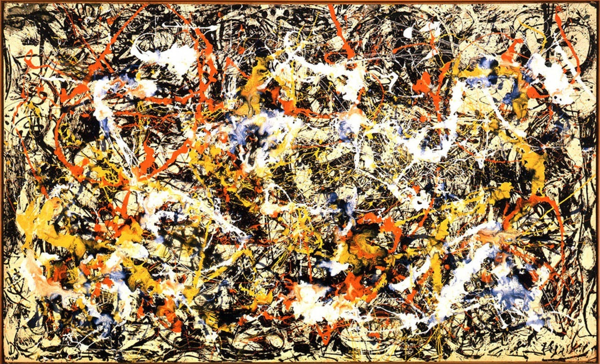

## 基本信息

- 作者：[[波洛克 Jackson Pollock]]
- 创作年代：1952
- 材质：油画于画布 (*not from wiki*)
- 尺寸：约 2.4 m × 4 m (*not from wiki*)
- 现存地：奥尔布赖特-诺克斯美术馆 Albright-Knox Art Gallery, Buffalo (*not from wiki*)

## 画面与技法

[[滴画法 Drip Painting]] 中后期作品，色彩更为丰富，是波洛克在 1950 年《[[秋韵 Autumn Rhythm]]》后精神危机期仍维持高水准的代表作。

## 历史背景 (*not from wiki*)

1952 年波洛克陷入精神危机已两年，"再一次酗酒无度，也失去了创作的激情"。但这幅画显示他仍能间歇产出高质量作品。距 1956 年的车祸还有 4 年。

## 图片清单

| 编号 | 出自 | 描述 |
|---|---|---|
| 01 | [[096｜波洛克：什么是当代艺术的第一个流派？]] | 合流 Convergence (1952) |

## 出现在

- [[096｜波洛克：什么是当代艺术的第一个流派？]]
