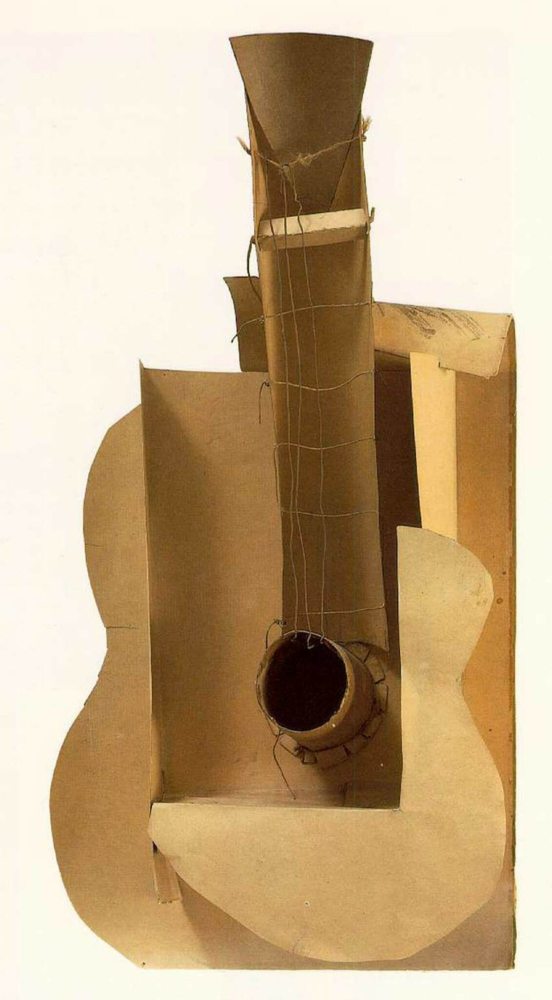

## 基本信息

- 作者：[[毕加索 Pablo Picasso]]
- 创作年代：1912
- 材质：纸板、铁丝（拼贴/构造） (*not from wiki*)
- 尺寸：约 65.1 × 33 × 19 cm (*not from wiki*)
- 现存地：纽约现代艺术博物馆 (MoMA) (*not from wiki*)

## 画面与技法

[[毕加索 Pablo Picasso]] [[综合立体主义 Synthetic Cubism]] 阶段的关键三维试作——**用铁丝和纸板做拼贴**的手法，把平面 [[拼贴 Collage]] 推到三维构造的边缘。

顾衡 086 在塔特林叙事里给本作定下决定性地位：**1914 年一战前夕，[[塔特林 Vladimir Tatlin]] 以歌手和班杜拉琴演奏家身份随俄罗斯民间艺术团造访巴黎，参观了毕加索的画室，看到的就是本作**。"毕加索用铁丝和纸板做拼贴的手法，让塔特林大为震惊。"——回俄后塔特林的创作明显受到 [[毕加索 Pablo Picasso]] 和 [[勃拉克 Georges Braque]] 综合立体主义的影响，最终把"拼贴立体主义三维化"为 [[角落里的反浮雕 Corner Counter-Relief]]，开启 [[构成主义 Constructivism]]。

## 图片清单

| 编号 | 出自 | 描述 |
|---|---|---|
| 01 | [[086｜塔特林：什么是构成主义？]] | 纸板与铁丝构造 |

## 出现在

- [[086｜塔特林：什么是构成主义？]]
