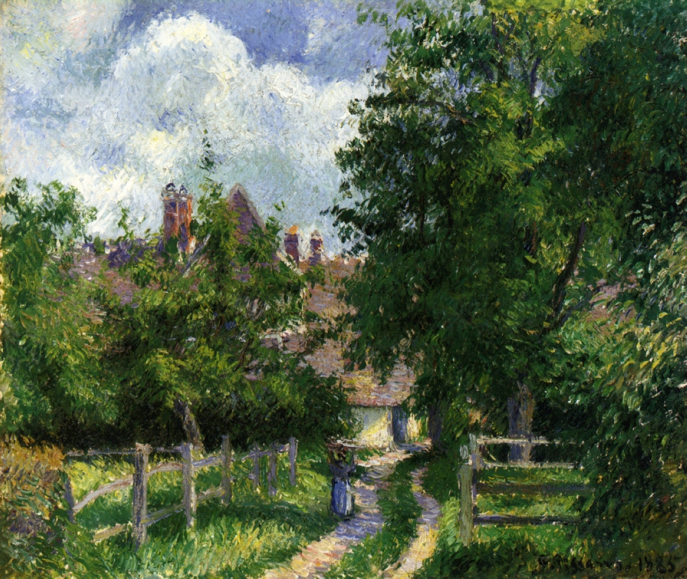

## 基本信息

- 作者：[[毕沙罗 Camille Pissarro]]
- 创作年代：1885
- 材质：布面油画 (*not from wiki*)
- 尺寸：(*not from wiki*) 约 54 × 65 cm
- 现存地：(*not from wiki*) 私人收藏

## 画面与技法

[[毕沙罗 Camille Pissarro]] **1890 前乡居时期**作品——法国诺曼底地区努弗勒-圣马丁村（位于吉索 Gisors 附近）的乡间风景。延续毕沙罗一贯的**轻抹淡扫**笔触与**温和的色调过渡**。

## 在课程中的角色

顾衡 044 把它列入毕沙罗 1890 前乡居时期"画的是农村不起眼的风景"的代表作组——与《[[林中小径 The Woods at Marly]]》《[[蓬图瓦兹附近的小村庄 Hamlet around Pontoise]]》《[[蓬图瓦兹的丰收 The Harvest Pontoise]]》共同呈现"恬淡内敛"的毕沙罗基调。

## 图片清单

| 编号 | 出自 | 描述 |
|---|---|---|
| 01 | [[044｜莫利索和毕沙罗：最纯正的印象派什么样？]] | 全画 |

## 出现在

- [[044｜莫利索和毕沙罗：最纯正的印象派什么样？]] —— 毕沙罗乡居时期作品组
- [[毕沙罗 Camille Pissarro]] —— 代表作之一
