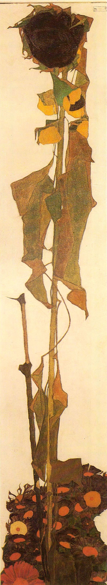

## 基本信息

- **作者**：[[席勒 Egon Schiele]]
- **创作年代**：1909–1910
- **材质**：油彩 / 画布 (*not from wiki*)
- **现存地**：维也纳 Leopold Museum (*not from wiki*)

## 画面与技法

顾衡 075 把此作作为"**北方哥特风**席卷席勒万物"之典型——**不光人物，连向日葵和树都是浓浓的北方哥特风**：**高高的、瘦瘦的、冷峻的**。

与 [[凡·高 Vincent van Gogh]] 的 [[15朵向日葵 Still Life with 15 Sunflowers]] 形成鲜明对照——后者炽烈、饱满、充满生命；席勒的向日葵**瘦削枯萎、垂头丧气**，是把植物当作**神经官能症患者**来画。

## 历史背景 (*not from wiki*)

席勒不止一件向日葵作品；本课所引这件常被认为是受凡·高启发，但被席勒以**北方哥特/表现主义**的形式语言彻底改写——同一母题在两种现代主义路径下的对照样本。

## 图片清单

| 编号 | 出自 | 描述 |
|---|---|---|
| 01 | [[075｜席勒2：为什么他是"最表现主义"的画家？]] | 单株向日葵 |

## 出现在

- [[075｜席勒2：为什么他是"最表现主义"的画家？]]
