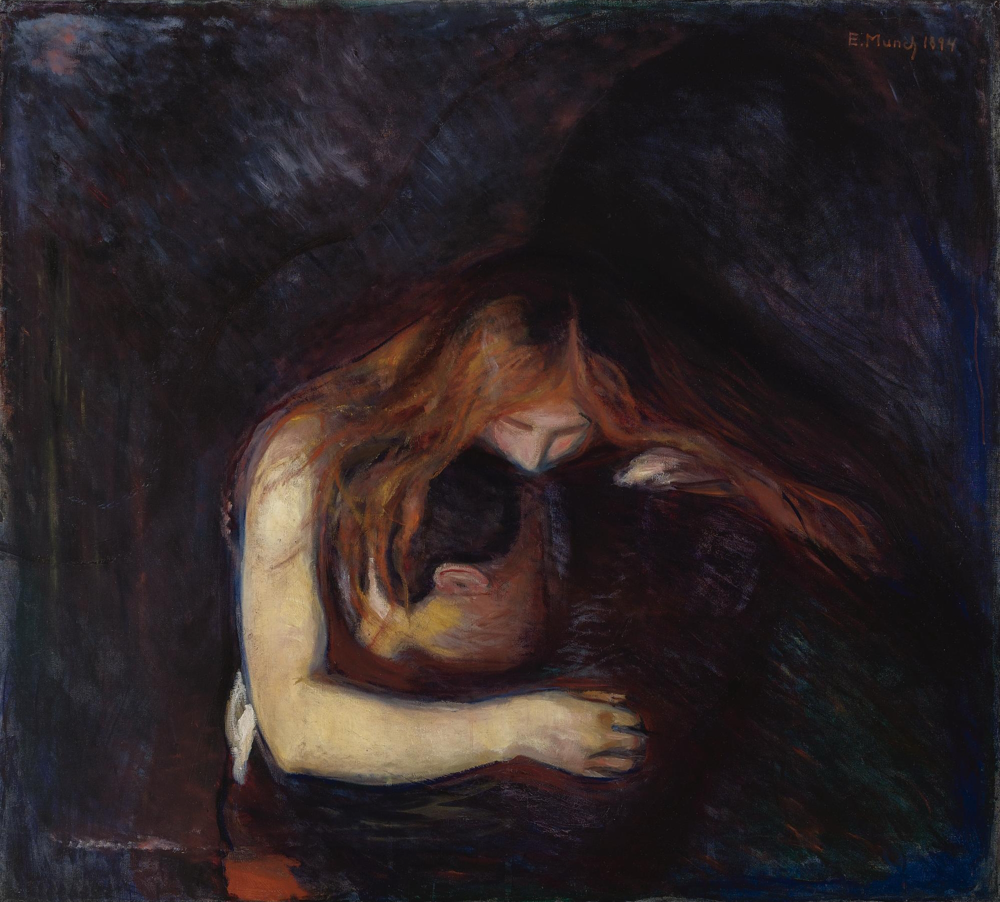

## 基本信息

- 作者：[[爱德华·蒙克 Edvard Munch]]
- 创作年代：1895
- 材质：布面油画 (*not from wiki*)
- 尺寸：未注明
- 现存地：未注明

## 画面与技法

一位女子俯身于男子颈侧的暧昧场景——蒙克原命名为 **"爱与痛 (Love and Pain)"**，但因画面构图被观者读作"女人吸食男人之血"，渐被以 **"吸血鬼 (Vampire)"** 之名流传（顾衡 070 用 "吸血鬼/爱与痛 Vampire/Love and Pain" 复合命名）。

## 历史背景 (*not from wiki*)

蒙克本人否认"吸血鬼"读法。在 1893–1895 间画了多个版本。本作是德国表现主义"**女人是祸水**"母题（顾衡 070 提到的 [[易卜生 Henrik Ibsen]]《培尔·金特》《群鬼》同源）的画面浓缩，也连接到日尔曼民族**仇女厌女**情绪的思想史脉络。

## 图片清单

| 编号 | 出自 | 描述 |
|---|---|---|
| 01 | [[070｜蒙克1：表现主义的先行者经历了什么？]] | 红发女子俯身男子颈侧 |

## 出现在

- [[070｜蒙克1：表现主义的先行者经历了什么？]]
