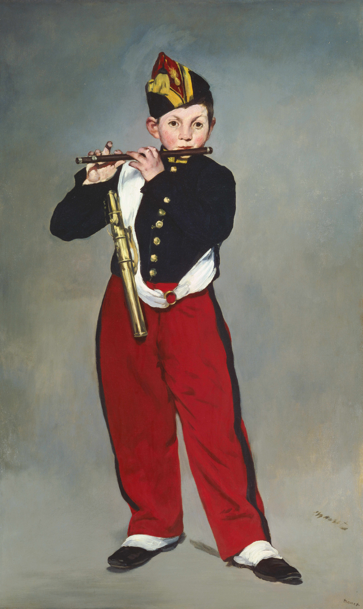

## 基本信息

- 作者：[[马奈 Édouard Manet]]
- 创作年代：1866
- 材质：油彩，画布 (*not from wiki*)
- 尺寸：161 × 97 cm (*not from wiki*)
- 现存地：奥赛博物馆，巴黎 (*not from wiki*)

## 画面与技法

马奈的西班牙风名作之一，与 [[穿斗牛士服的维多琳小姐 Mademoiselle V in the Costume of an Espada]] 同属"精准素描 + 自由奔放笔触"的代表。**深色背景上的少年完全没有阴影、没有景深线索**——画面强烈呈现**二维平面感**，这是 [[向二维平面回归 Return to Flatness]] 在马奈早期作品中的清晰体现 (*not from wiki*)。

颜色使用**简洁明快**、没有那么多模棱两可的中间色与过渡色——顾衡指出这是马奈与 [[委拉斯贵支 Diego Velázquez]] 最大的区别，也是**后世画家对马奈极为推崇的重要原因**。

## 历史背景 (*not from wiki*)

- 1866 年沙龙拒绝展出
- 模特为一名近卫军军乐队的少年笛手
- 马奈在创作前不久（1865）赴马德里普拉多博物馆亲见委拉斯贵支原作，深受震动

## 图片清单

| 编号 | 出自 | 描述 |
|---|---|---|
| 01 | [[039｜马奈2：画家如何应对照相机的冲击？]] | 全图，深灰色背景前的少年笛手 |

## 出现在

- [[039｜马奈2：画家如何应对照相机的冲击？]]
