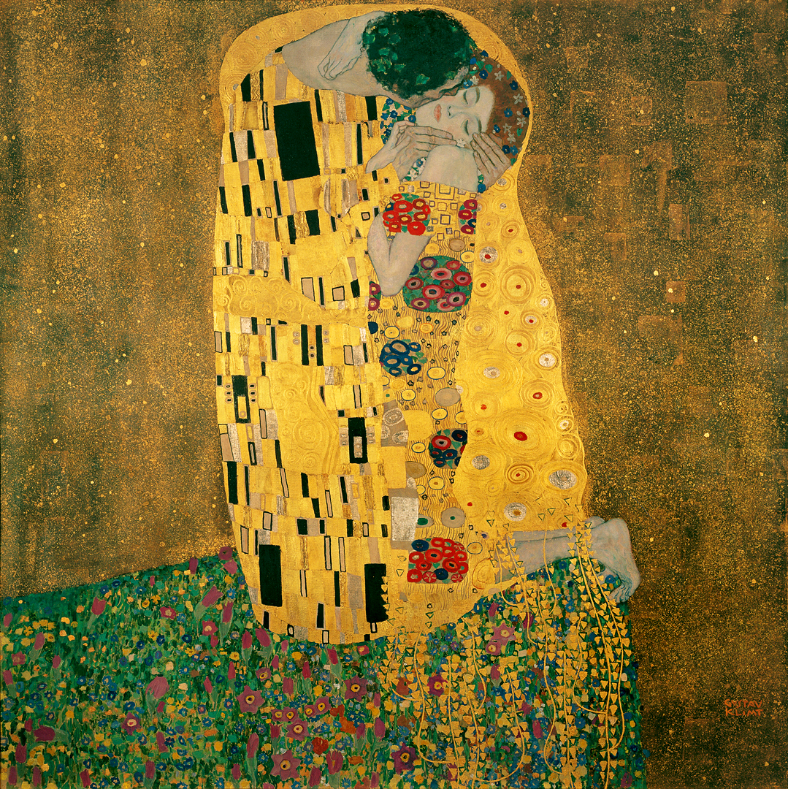

## 基本信息

- 作者：[[克里姆特 Gustav Klimt]]
- 创作年代：1907–1908
- 材质：（*not from wiki*）布面油画、金箔
- 尺寸：（*not from wiki*）180 × 180 cm
- 现存地：（*not from wiki*）维也纳贝尔维德雷宫上宫 Belvedere

## 画面与技法

[[克里姆特 Gustav Klimt]] **最著名的作品**（顾衡 073）——是他**象征性**风格的代表。

顾衡 073 解码："**男人身上长方形的图饰**，**女人身上的圆形图饰**，这明显是**性的象征**。"——克里姆特的作品到处都是这种**密码本路数**。

形式上是 [[阿黛尔夫人像 Adele Bloch-Bauer]] 同期"金色时期"的延续：金箔 + 拜占庭 / 阿拉伯几何 + 极致装饰性。

## 历史背景 (*not from wiki*)

- 与阿黛尔夫人像同属克里姆特"金色时期"（约 1899–1910）
- 1908 维也纳艺术展 Kunstschau 上首次展出即被奥地利政府以 25000 克朗购藏 —— 克里姆特生前最高单幅售价
- 全球最高知名度的 Klimt 作品

## 图片清单

| 编号 | 出自 | 描述 |
|---|---|---|
| 01 | [[073｜克里姆特：什么是维也纳分离派？]] | 吻全图 |

## 出现在

- [[073｜克里姆特：什么是维也纳分离派？]]
