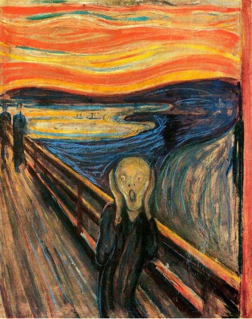
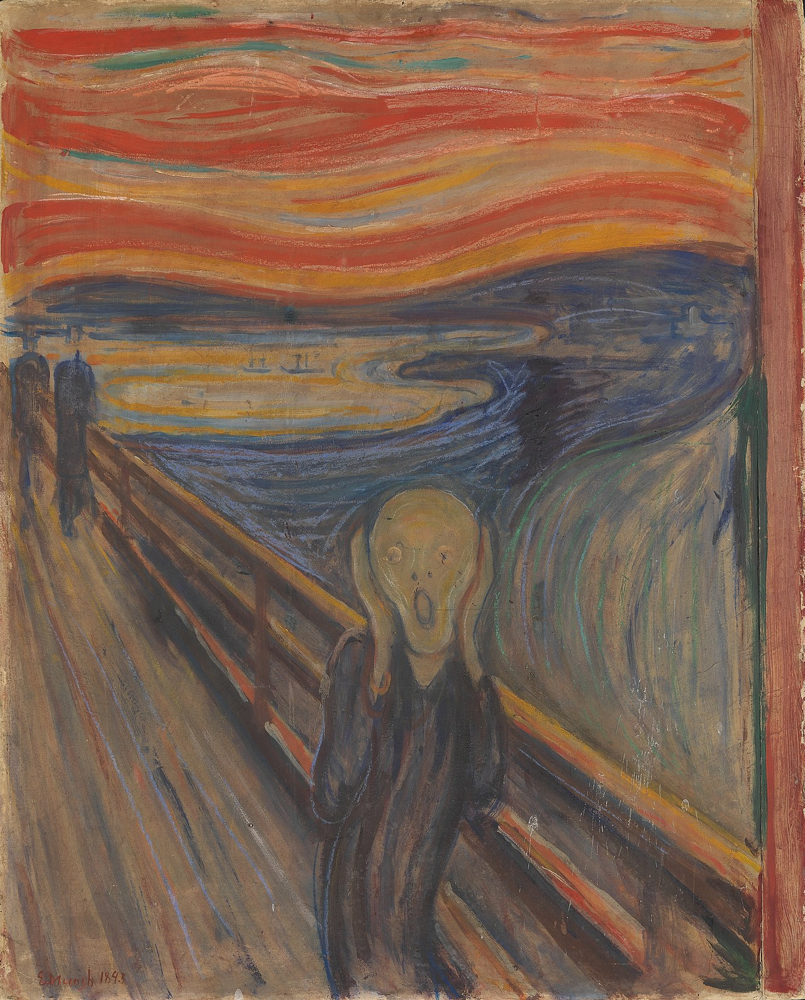
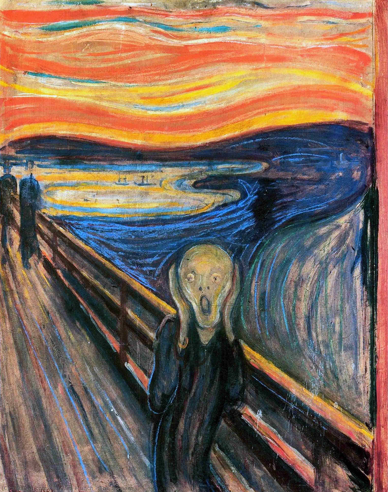

## 基本信息

- 作者：[[爱德华·蒙克 Edvard Munch]]
- 创作年代：1893
- 材质：木板蛋彩与蜡笔 (*not from wiki*)
- 尺寸：91 × 73.5 cm (*not from wiki*)
- 现存地：奥斯陆国家博物馆 (1893 版)；存在多个版本 (*not from wiki*)

## 画面与技法

蒙克最著名的作品，创作于 1893 年——**正是蒙克沉迷于象征主义绘画理念的时期**（顾衡 070）。

顾衡 070 提示：[[呐喊 The Scream]] **并不是表现主义的，而是象征主义的**——这一点对理解蒙克自身的流派归属史尤其关键。

蒙克在这幅画中**固定下来两个程式**（[[蒙克程式 Munch's Pictorial Formulas]]）：

1. **不真实的、椭圆型的嘴**——表达焦虑和恐惧
2. **斜向栏杆形成强烈透视效果**——创造神奇的吸力，把观者注意力牢牢固定在前景的绘画主题上

灵感来源：1889 世博会上 **秘鲁挖出的一具印加木乃伊**——像胎儿一样蜷曲在罐子里。**从生到死，在逼仄罐子里被永久定格**——给蒙克留下了极为深刻的印象，本作**很大程度上就受了这个木乃伊的启发**（顾衡 070）。

## 历史背景 (*not from wiki*)

蒙克自己的解读（顾衡 070 引）：
> 我很累，而且有病，我站下来眺望一座峡湾，太阳正落山，云彩呈现出红色，像血液一样，我觉得有一股东西流过大自然，我以为我听到了一声呐喊，我就画下了这幅画，把云彩画得跟真正的血液一样，是色彩在呐喊。

存在 4 个主要版本（1893 × 2、1895、1910），属蒙克的 [[爱组画 The Frieze of Life]] 六联画之一。

## 图片清单

| 编号 | 出自 | 描述 |
|---|---|---|
| 01 | [[070｜蒙克1：表现主义的先行者经历了什么？]] | 1893 版——血色天空、骷髅头形主体、斜向栏杆 |

## 出现在

- [[070｜蒙克1：表现主义的先行者经历了什么？]]
