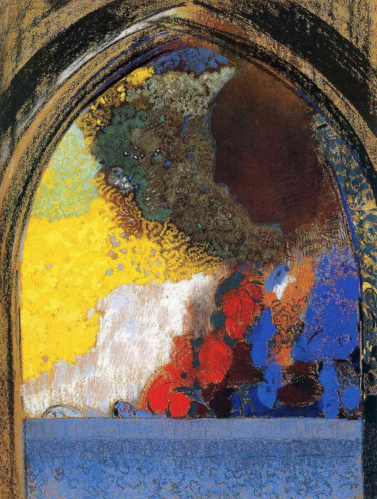

## 基本信息

- 作者：[[雷东 Odilon Redon]]
- 创作年代：1907
- 材质：年代不详（雷东中后期粉彩 / 油彩）
- 尺寸：年代不详
- 现存地：未注明

## 画面与技法

侧脸的女性置于一个哥特式拱门之下——人物轮廓被处理得朦胧、不确定，雷东早年自述 "**任何事物的轮廓在我眼里都是朦胧的、不确定的**" 在此得到延续。雷东在中后期保留了梦境感氛围，同时引入了饱和色彩。

## 历史背景 (*not from wiki*)

哥特式建筑细节作为母题在雷东作品中并不常见，本作可视为雷东**梦境母题与建筑符号结合**的少见样本。

## 图片清单

| 编号 | 出自 | 描述 |
|---|---|---|
| 01 | [[051｜雷东：怪诞是不是象征主义的方向？]] | 侧面女性置于哥特拱门下 |

## 出现在

- [[051｜雷东：怪诞是不是象征主义的方向？]]
