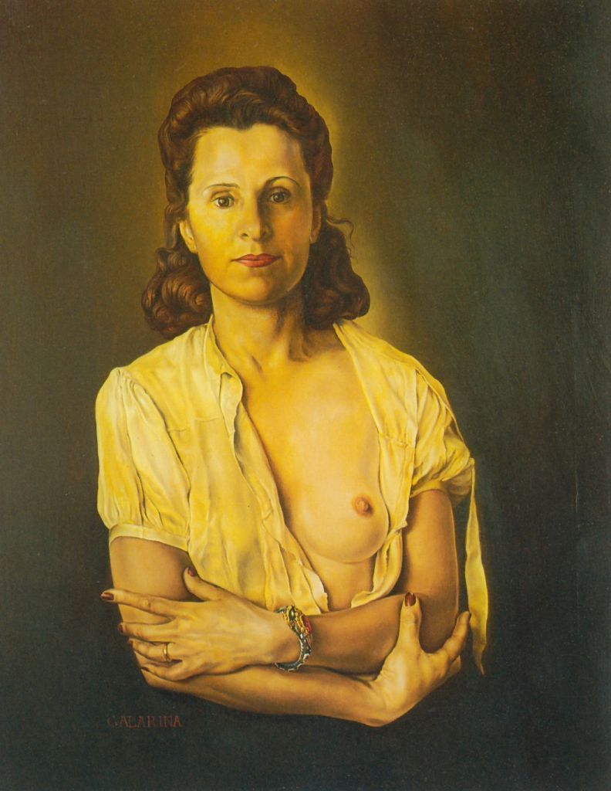

## 基本信息

- 作者：[[达利 Salvador Dalí]]
- 创作年代：1944–1945
- 材质：布面油画 (*not from wiki*)
- 尺寸：(*not from wiki*) 64.1 × 50.2 cm
- 现存地：(*not from wiki*) 西班牙菲格拉斯达利剧院博物馆（Teatro-Museo Dalí, Figueres）

## 画面与技法

094 中作为达利与 [[加拉 Gala Dalí]] 关系的图像注脚出场——画面中加拉裸露右胸、左手撑桌、目光直视观众，姿态被达利刻意比附为拉斐尔《[[卡斯蒂廖尼伯爵 (拉斐尔) Portrait of Baldassare Castiglione]]》的当代女性版。

(*not from wiki*) 题名 "Galarina" 是达利自造的爱称——把 "Gala" 与 "Fornarina"（拉斐尔情人模特"面包师之女"）合在一起——明示这幅画是达利对**艺术史经典缪斯传统**的接续。

## 历史背景 (*not from wiki*)

成于达利在美国的高产期（二战流亡纽约）。这一时期加拉正以全面操盘人身份打理达利的画展、版权与媒体——本画几乎是这种合作关系的图像合同书。

## 图片清单

| 编号 | 出自 | 描述 |
|---|---|---|
| 01 | [[094｜达利：为什么他画的是"伪装的梦"？]] | 加拉半身肖像 |

## 出现在

- [[094｜达利：为什么他画的是"伪装的梦"？]]
