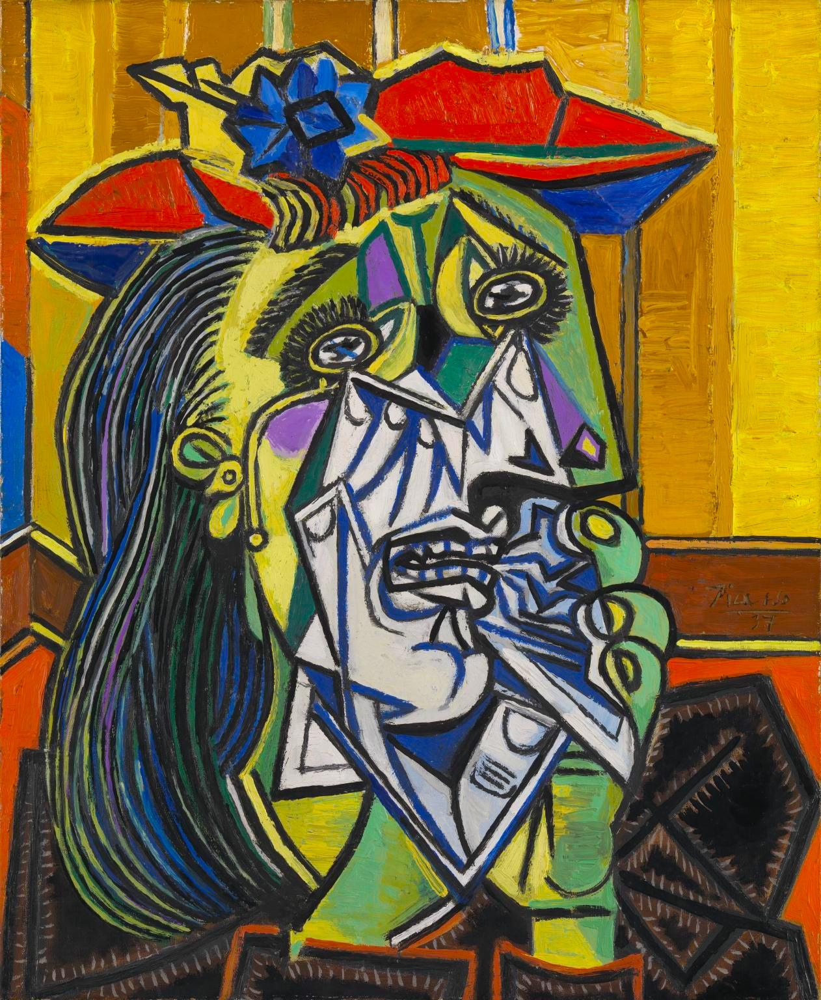

## 基本信息

- 作者：[[毕加索 Pablo Picasso]]
- 创作年代：1937
- 材质：(*not from wiki*) 布面油画
- 尺寸：(*not from wiki*) 60 × 49 cm
- 现存地：(*not from wiki*) Tate Modern, London

## 画面与技法

模特为毕加索情人 [[朵拉·玛尔 Dora Maar]]——超现实主义摄影师、共产党员、知识分子。画面以**鲜艳的紫红与蓝绿**呈现一名抽搐哭泣的女子，眼泪化为白色尖刺、面部多平面拼贴、手抓白手帕——是 [[综合立体主义 Synthetic Cubism]] + 情感强度的极致样本。

本作是《[[格尔尼卡 Guernica]]》的**情感外延**——毕加索同年完成《格尔尼卡》后，把画中"抱死婴的女人"母题拿出来发展成至少 36 张痛苦女性肖像，《哭泣的女人》是这一序列的最后一幅、最具标志性的一幅。

顾衡 067 列入"为情人画肖像、风格高度雷同"的样本之一。

## 历史背景

(*not from wiki*) 朵拉·玛尔 (Dora Maar, 本名 Henriette Theodora Markovitch, 1907-1997) 是 1936 年起毕加索的情人，因其曾用相机记录《格尔尼卡》创作过程而留名艺术史。她以"我可以哭——而且是一种艺术"被毕加索反复入画，但本人智识与才华被压抑，1945 年与毕加索分手后陷入抑郁。本作 1956 年由 [[罗兰特·潘罗斯 Roland Penrose]] 收藏，1987 年捐赠 Tate。

## 图片清单

| 编号 | 出自 | 描述 |
|---|---|---|
| 01 | [[067｜毕加索4：什么是综合立体主义？]] | 整体图（模特：朵拉·玛尔） |

## 出现在

- [[067｜毕加索4：什么是综合立体主义？]]
