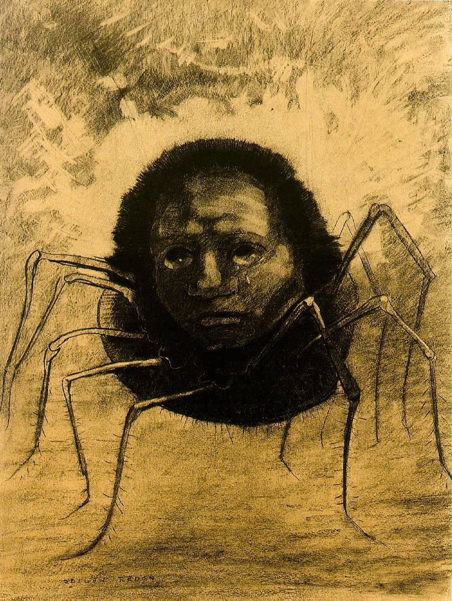

## 基本信息

- 作者：[[雷东 Odilon Redon]]
- 创作年代：1881
- 材质：炭笔（*not from wiki*：雷东的早期 noirs 系列以炭笔为主）
- 尺寸：年代不详
- 现存地：私人收藏 / 多版本（*not from wiki*）

## 画面与技法

雷东早期黑白怪诞母题的代表作之一——拟人化的蜘蛛，多足上扬，面部带泪痕。顾衡 051 列为雷东 "**病和狂的梦幻曲**"（[[于斯曼 Joris-Karl Huysmans]] 评语）的典型样本。

## 历史背景 (*not from wiki*)

雷东将动物 / 昆虫赋予人脸表情，是其早期 noirs 中的反复母题（另有"微笑的蜘蛛"）——预示了 20 世纪超现实主义梦境绘画的视觉语言。

## 图片清单

| 编号 | 出自 | 描述 |
|---|---|---|
| 01 | [[051｜雷东：怪诞是不是象征主义的方向？]] | 拟人化哭泣蜘蛛 |

## 出现在

- [[051｜雷东：怪诞是不是象征主义的方向？]]
