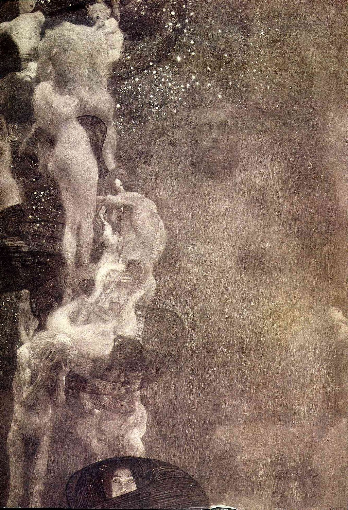

## 基本信息

- 作者：[[克里姆特 Gustav Klimt]]
- 创作年代：1899–1907
- 材质：（*not from wiki*）天顶壁画 / 布面油画
- 尺寸：（*not from wiki*）430 × 300 cm
- 现存地：**1945 年毁于纳粹炮火**

## 画面与技法

维也纳大学礼堂三联画之一（与 [[医学 Medicine (克里姆特)]] / [[法学 Jurisprudence (克里姆特)]] 同批）。顾衡 073 注："法学和哲学你画个女人没啥"——但三联合起来满墙女人，依然惹怒维也纳大学教授群。

## 历史背景 (*not from wiki*)

- 1900 年首次部分展出即遭维也纳大学哲学系教授联名抗议
- 1945 年与另两幅一同毁于因门多夫城堡 Schloss Immendorf 火灾

## 图片清单

| 编号 | 出自 | 描述 |
|---|---|---|
| 01 | [[073｜克里姆特：什么是维也纳分离派？]] | 哲学（彩色还原）全图 |

## 出现在

- [[073｜克里姆特：什么是维也纳分离派？]]
