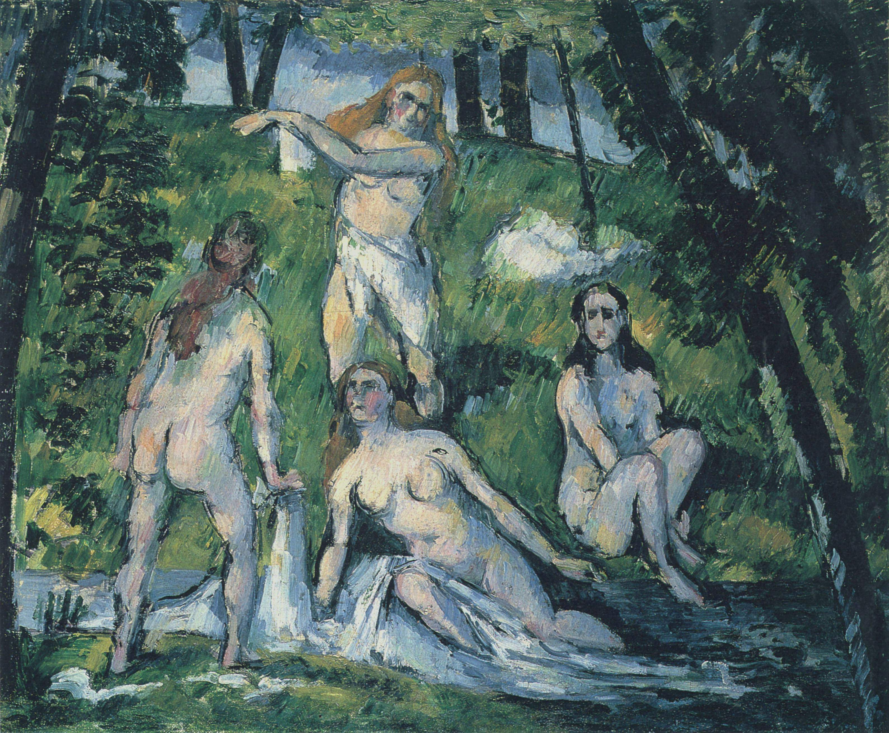

## 基本信息

- 作者：[[塞尚 Paul Cézanne]]
- 创作年代：1877–1878
- 材质：油彩，画布 (*not from wiki*)
- 尺寸：(*not from wiki*) 约 35 × 46 cm（小幅版本）
- 现存地：(*not from wiki*) 法国 / 美国多版本流转

## 画面与技法

[[塞尚 Paul Cézanne]] 早期"浴女"母题之一，承上接 [[三个浴女 Three Bathers]]（1874-75）、下启晚年巨幅 [[浴女们 The Large Bathers]]。顾衡 054 在小结段引证本作：

> 山也好，树也好，甚至女人的身体也好，都呈现出一种"结晶"的效果。

即——人体不再被处理为有机的肉感曲面，而是被简化为色块与几何骨骼相互应和的**结构性单元**。这是 [[罗杰·弗莱 Roger Fry]] 提出的[[结晶 (塞尚) Crystallization|结晶]]效果的人体样本。

## 历史背景 (*not from wiki*)

1877-78 处于塞尚"印象派学徒期"的尾段、与第三阶段"成熟期"（1880 前后开始）的过渡段。本作之后塞尚反复回到"浴女"主题——直到 1906 年去世前都在画《大浴女》。立体主义画家（毕加索、勃拉克）从塞尚的浴女系列汲取了**将人体简化为几何形**的关键线索。

## 图片清单

| 编号 | 出自 | 描述 |
|---|---|---|
| 01 | [[054｜塞尚3：为什么理解塞尚那么困难？]] | 全图——浴女母题"结晶"效果样本 |

## 出现在

- [[054｜塞尚3：为什么理解塞尚那么困难？]] —— "结晶"效果的人体样本
