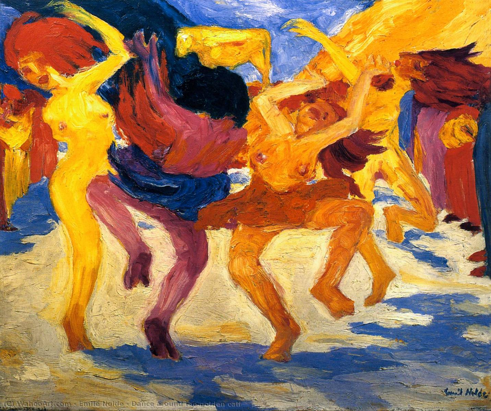

## 基本信息

- **作者**：[[诺尔德 Emil Nolde]]
- **创作年代**：1910
- **材质**：布面油画 (*not from wiki*)
- **尺寸**：88 × 105.5 cm (*not from wiki*)
- **现存地**：慕尼黑现代美术馆 Pinakothek der Moderne, Munich (*not from wiki*)

## 画面与技法

- 072 中作为诺尔德**"形的崩溃"标志性三联例**之一（与 [[疯狂跳舞的孩子 (诺尔德) Wildly Dancing Children]]、[[蜡烛与舞者 (诺尔德) Candle Dancers]] 并列）。
- **题材**：《出埃及记》中以色列人摩西离开后围着金牛犊狂舞、堕入偶像崇拜的旧约场景——经诺尔德笔下转化为狂喜、肉欲与原始宗教激情的剧烈纠缠。
- 色彩鲜艳到刺眼；身体剧烈扭动——是 [[表现主义 Expressionism]]"在画布上渲泻情感"的范本，也成为 [[休谟 David Hume]]"艺术必须是美的"共识瓦解的临界点。

## 历史背景 (*not from wiki*)

1910 是诺尔德"专属表现主义语言"成型之年——此画与同年的 [[秋天的海 (诺尔德) Autumn Sea]] 一起划出从"综合期"到"形崩溃期"的分界。

## 图片清单

| 编号 | 出自 | 描述 |
|---|---|---|
| 01 | [[072｜桥社：什么是表现主义绘画的使命？]] | Dance Around the Golden Calf 1910 — 形崩溃 |

## 出现在

- [[072｜桥社：什么是表现主义绘画的使命？]]
