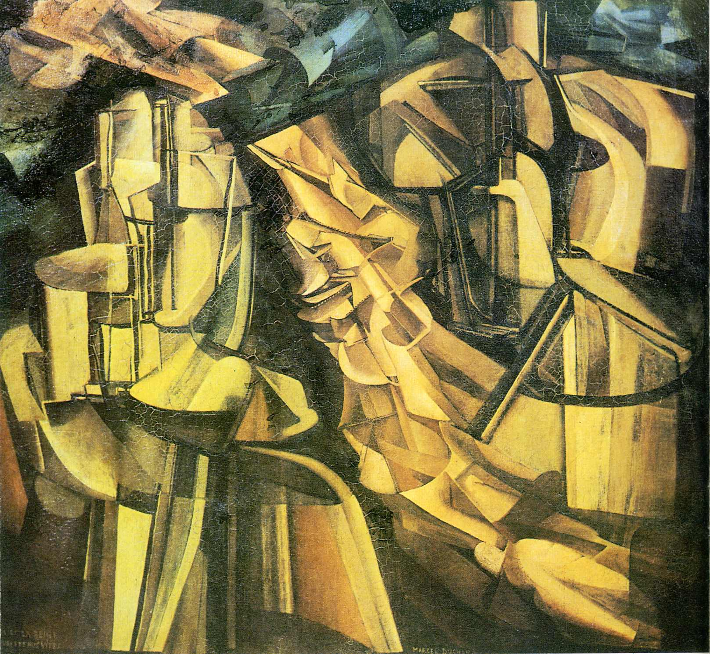

## 基本信息

- 作者：[[杜尚 Marcel Duchamp]]
- 创作年代：1912
- 材质：布面油画 (*not from wiki*)
- 尺寸：114.6 × 128.9 cm (*not from wiki*)
- 现存地：费城美术馆 (Philadelphia Museum of Art) (*not from wiki*)

## 画面与技法

1912 年慕尼黑系列的高潮——杜尚在《[[下楼梯的裸女 Nude Descending a Staircase No. 2]]》被 [[皮托集团 Puteaux Group]] 退稿后"按惯性、按赌气"继续推进的机器/运动主题。顾衡评为"杜尚一生中最好的几幅油画作品"之一，"还是表现出了很多的机器，很多的运动"。

国王、王后的人体被还原为金属化的机械结构，"快速移动的裸女"以分解动作的轨迹围绕——既继承了《[[下楼梯的裸女 Nude Descending a Staircase No. 2]]》的多时间叠合，也朝着后来《大玻璃》的机械情欲符号系统前进。(*not from wiki*)

## 历史背景

(*not from wiki*) 1912 年同期作品。与《[[新娘 Bride (Duchamp)]]》《[[从处女到已婚妇女的过程 The Passage from Virgin to Bride]]》同被纳入 1912 年 10 月由 [[杰克·维庸 Jacques Villon]] 主持的《黄金分割展》。

## 图片清单

| 编号 | 出自 | 描述 |
|---|---|---|
| 01 | [[089｜杜尚2：什么是他人生的转折点？]] | 整图 |

## 出现在

- [[089｜杜尚2：什么是他人生的转折点？]]
