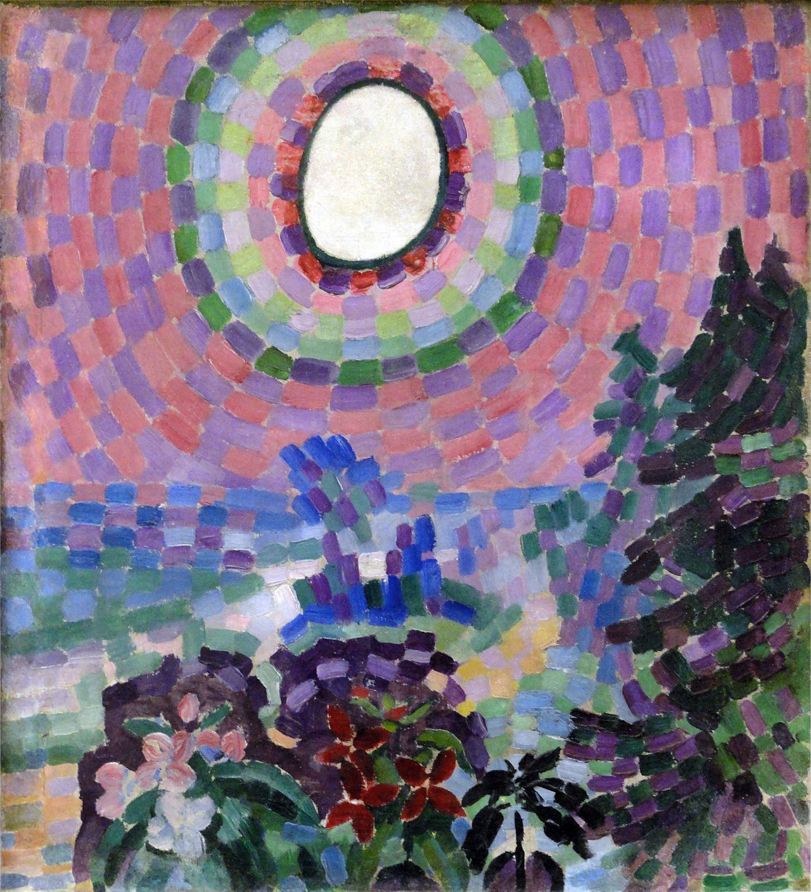

## 基本信息

- 作者：[[德劳内 Robert Delaunay]]
- 创作年代：1906
- 材质：布面油画 (*not from wiki*)
- 尺寸：约 55 × 46 cm (*not from wiki*)
- 现存地：巴黎现代艺术博物馆 (Centre Pompidou) (*not from wiki*)

## 画面与技法

德劳内**早期**作品，仍处于"**勉强算是 [[点彩 Pointillism|点彩派]] 范畴**"内的阶段——色块比 [[修拉 Georges Seurat]] / [[西涅克 Paul Signac]] 的点要大。一片山野风景，上方一颗白色圆盘 (太阳或月亮) 主导画面。

顾衡指出：德劳内**不是经由 [[塞尚 Paul Cézanne]]、而是经由 [[修拉 Georges Seurat]] 进入立体主义**——色彩理论是他的入口。

## 历史背景 (*not from wiki*)

被视为德劳内**从 [[新印象主义 Neo-Impressionism]] 向自创俄耳浦斯立体主义过渡**的早期标志作之一。

## 图片清单

| 编号 | 出自 | 描述 |
|---|---|---|
| 01 | [[068｜立体主义，除了毕加索还值得了解什么？]] | 早期点彩风景，上方一颗大圆盘 |

## 出现在

- [[068｜立体主义，除了毕加索还值得了解什么？]] —— 德劳内"经由修拉入立体主义"的早期证据
