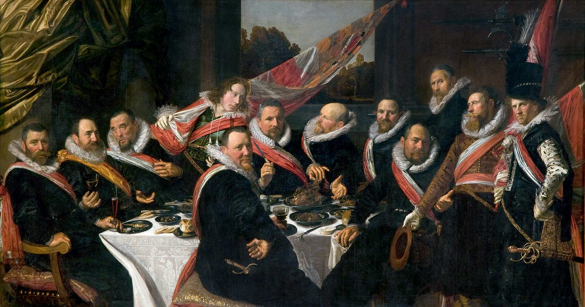

## 基本信息

- 作者：[[哈尔斯 Frans Hals]]
- 创作年代：1616
- 材质：布面油画 (*not from wiki*)
- 尺寸：约 175 × 324 cm (*not from wiki*)
- 现存地：弗兰斯·哈尔斯美术馆 Frans Hals Museum, Haarlem (*not from wiki*)

## 画面与技法

哈尔斯为哈勒姆**圣乔治市民警卫队的军官们**所画的大型集体像——12 个人在宴桌前。他的解法是 [[荷兰黄金时代 Dutch Golden Age]] 群像三条路径中**最早的一条**：**虚拟事件 / 虚拟迟到者**——

> 哈尔斯虚拟了一个迟到者，给了大家扭头看画面外的理由。而且其中还有四个人的目光并没有看向画外，而是与同伴交谈。这就让画面一下子生动起来了。

集体像最大的死板感来自"全员朝镜头"——哈尔斯的解法**为画外引入一个'事件'**，让所有人有理由打破对称，**部分人转头看事件、部分人继续交谈**，瞬间盘活合影。

这一方法直接是 [[伦勃朗 Rembrandt]] 后来在《[[夜巡 The Night Watch]]》(1642) 中**戏剧化推到极致**的前史。

## 历史背景

(*not from wiki*) 1616 完成，是哈尔斯首件大型公共订件，奠定他在哈勒姆的地位。哈尔斯后又为同一民兵连画过几件官员像。

## 图片清单

| 编号 | 出自 | 描述 |
|---|---|---|
| 01 | [[025｜伦勃朗1：为什么他被称为荷兰最伟大的画家？]] | 整体 |

## 出现在

- [[025｜伦勃朗1：为什么他被称为荷兰最伟大的画家？]]
