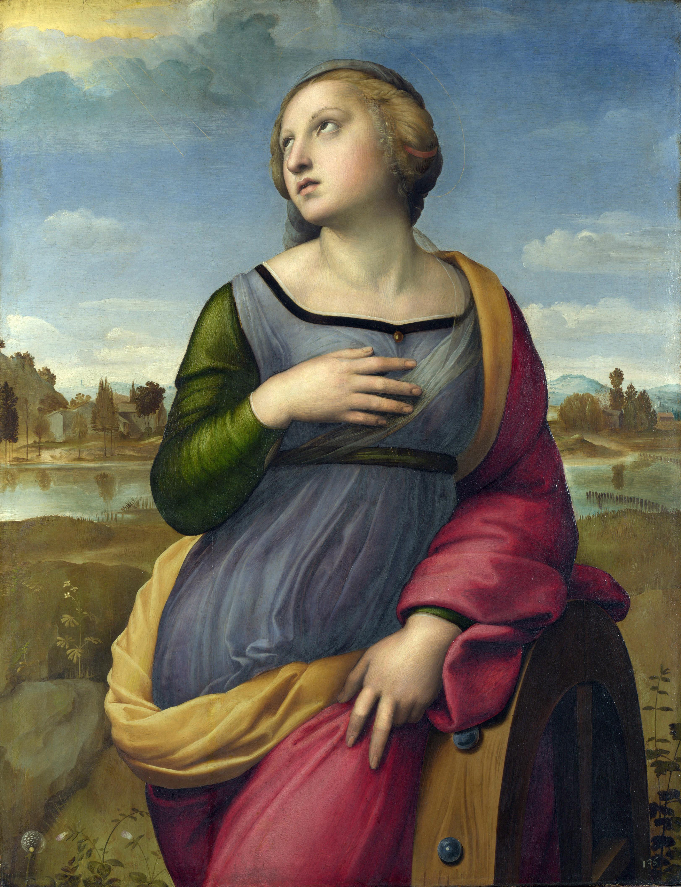

## 基本信息

- 作者：[[拉斐尔 Raphael]]
- 创作年代：1507–1508 (*not from wiki*)
- 材质：木板油画
- 尺寸：71 × 56 cm (*not from wiki*)
- 现存地：伦敦国家美术馆 (The National Gallery, London) (*not from wiki*)

## 画面与技法

四分之三身像。圣凯瑟琳侧身倚靠**带钉齿的轮子**（其殉道工具）——身体呈优雅的 [[S 造型 Contrapposto]]——仰头望向画面右上方一束神光。

构图把 [[仰望星空母题 (出神) Star-gazing Motif]] 浓缩到单人像里：观者通过她的目光被引向画面外的神性来源。背景温和的风景与橙红斗篷形成色彩呼应。

## 历史背景

(*not from wiki*) 圣凯瑟琳（亚历山大的凯瑟琳，4 世纪传说圣徒）：基督教学者，皇帝马克西米努斯派 50 位哲学家与她辩论败北，将她钉在带钉齿的轮子上殉道；后被基督徒迁葬西奈山。学者守护圣女。

008 顾衡用它作为 [[仰望星空母题 (出神) Star-gazing Motif]] 的另一个范例，构图比 [[圣塞西莉亚 St Cecilia]] 简化，但"出神"姿势更清晰。

## 图片清单

| 编号 | 出自 | 描述 |
|---|---|---|
| 01 | [[008｜文艺复兴到底复兴了什么？]] | 整体图 |

## 出现在

- [[008｜文艺复兴到底复兴了什么？]]
