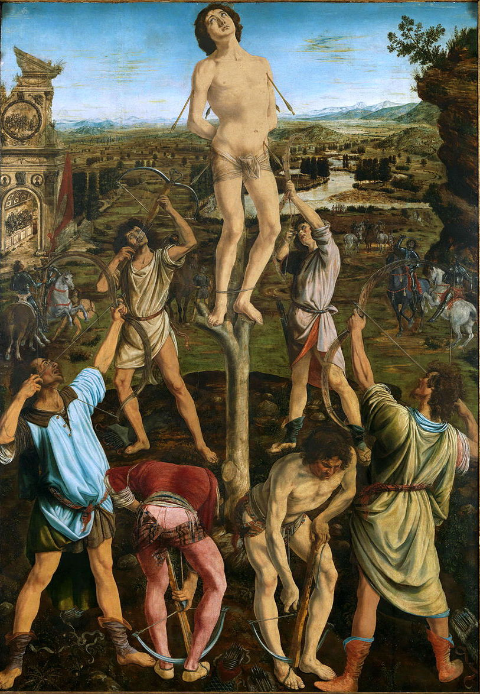

## 基本信息

- 作者：[[波拉约洛 Antonio del Pollaiuolo]]（与其弟 Piero del Pollaiuolo 合作） (*not from wiki*)
- 创作年代：1473–1475
- 材质：木板油彩 (*not from wiki*)
- 尺寸：291.5 × 202.6 cm (*not from wiki*)
- 现存地：伦敦国家美术馆 (The National Gallery, London) (*not from wiki*)

## 画面与技法

构图**金字塔形**：

- **顶**：圣塞巴斯蒂安**绑在高高的木柱上**，赤裸上身，被箭射满
- **中**：六位弓手围成**对称三角阵**——三位拉弓 / 三位上弦——展示**人体不同角度**（解剖学练习暗藏）
- **下景与远景**：托斯卡纳田野徐徐向远方铺开，蜿蜒的河流、远山、城堡——**完整的俯瞰式风景**

**顾衡 037 重点**：

- 解决了一个文艺复兴画家的两难：**风景要俯瞰才能近景中景远景连在一起**（贝里尼地图法），**但人物若也俯瞰则不够庄重**
- 波拉约洛的办法：**把十字架弄得高高的**，画家**爬到与圣徒一样的高度**——既能**和圣徒平视**，又能**像画地图那样画风景**
- 顾衡评价：**好是好——可是把 C 位拿木棍挑起两米高也不像话**——这个问题最终由 [[提香 Titian]]《神圣爱与世俗爱》的前景挡板法解决（差不多 30 年后）

## 历史背景

(*not from wiki*) 由佛罗伦萨 Pucci 家族委托，原置 Santissima Annunziata 教堂的 Pucci 礼拜堂。1857 年由 Pucci 家族售予英国国家美术馆。**人体解剖学的炫技**——同时段（1470s）佛罗伦萨画家普遍痴迷尸体解剖，达·芬奇晚期解剖图谱也属同一思潮。

## 图片清单

| 编号 | 出自 | 描述 |
|---|---|---|
| 01 | [[037｜为什么说古典时代没有风景画？]] | 整体图（圣徒被挑高 + 远景田野） |

## 出现在

- [[037｜为什么说古典时代没有风景画？]]
