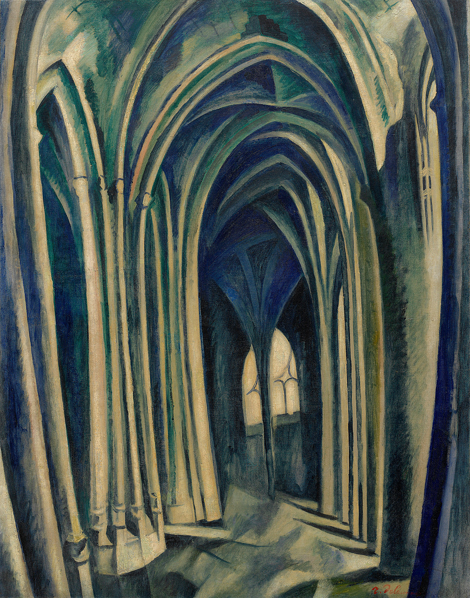

## 基本信息

- 作者：[[德劳内 Robert Delaunay]]
- 创作年代：1909
- 材质：布面油画 (*not from wiki*)
- 尺寸：约 96 × 70 cm (*not from wiki*)
- 现存地：所罗门·R·古根海姆博物馆 (Guggenheim, 纽约) (*not from wiki*)

## 画面与技法

德劳内**"圣塞沃林教堂"系列七幅**的第三件。仿莫奈《[[鲁昂大教堂系列 Rouen Cathedral]]》的"组画 / 系列"思路，但**他跑进教堂内部**画哥特彩窗洒进来的光影；画面纵深向中央祭坛递进、光斑在地面与列柱上斑驳跳跃。

是德劳内从 [[新印象主义 Neo-Impressionism]] 向自创**俄耳浦斯立体主义**过渡的代表系列。

## 历史背景 (*not from wiki*)

巴黎拉丁区 5 区的圣塞沃林教堂 (Saint-Séverin) 是 13–16 世纪建造的火焰式哥特教堂。德劳内 1909 年起在该教堂内部画了 7 张同题作品，越往后越**色彩复杂、形状趋于崩溃**。

## 图片清单

| 编号 | 出自 | 描述 |
|---|---|---|
| 01 | [[068｜立体主义，除了毕加索还值得了解什么？]] | 系列第 3 号；内部哥特彩窗与光斑 |

## 出现在

- [[068｜立体主义，除了毕加索还值得了解什么？]] —— 德劳内"光-色-哥特"系列的早期阶段
