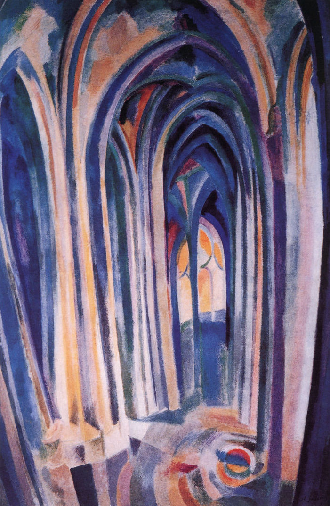

## 基本信息

- 作者：[[德劳内 Robert Delaunay]]
- 创作年代：1909—1910
- 材质：布面油画 (*not from wiki*)
- 尺寸：约 90 × 70 cm (*not from wiki*)
- 现存地：私人收藏 / 数版本 (*not from wiki*)

## 画面与技法

系列**第 7 号**——也是最后一件。**色彩比第 3 号更复杂、列柱被光弯曲到接近崩溃**。

顾衡评："**越往后色彩越是丰富和复杂，形状则趋于崩溃。**"这是德劳内即将**完全放弃具象、走向抽象**的征兆。

## 历史背景 (*not from wiki*)

是德劳内 1909–1910 年完成的圣塞沃林系列的最后一件，也是德劳内**抽象化 / 俄耳浦斯化**的关键转折点。

## 图片清单

| 编号 | 出自 | 描述 |
|---|---|---|
| 01 | [[068｜立体主义，除了毕加索还值得了解什么？]] | 系列第 7 号；列柱被光"弯曲" |

## 出现在

- [[068｜立体主义，除了毕加索还值得了解什么？]] —— 德劳内由具象走向抽象的临界点
