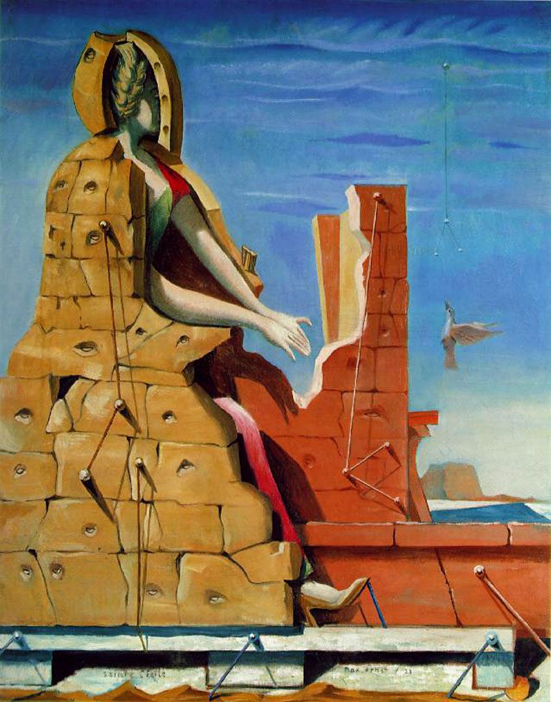

## 基本信息

- 作者：[[恩斯特 Max Ernst]]
- 创作年代：1923
- 材质：布面油画 (*not from wiki*)
- 现存地：斯图加特国立美术馆 Staatsgalerie Stuttgart (*not from wiki*)

## 画面与技法

恩斯特巴黎初期"诗意路径"组作之一。本课将其与《[[暧昧的女人 (恩斯特) The Wavering Woman]]》《[[俄狄浦斯王 (恩斯特) Oedipus Rex]]》《[[恩斯特的寝室 The Master's Bedroom]]》《[[乌比王 (恩斯特) Ubu Imperator]]》《[[第一个清晰的字眼 (恩斯特) The First Clear Word]]》并列展示，统一作为 [[艾吕雅 Paul Éluard]] 启发下"用错位搭配制造诗意"的实践。

主体（圣塞西莉亚，音乐圣徒）+ "看不见的钢琴"——**这个搭配本身**就是错位诗意所在。

## 图片清单

| 编号 | 出自 | 描述 |
|---|---|---|
| 01 | [[093｜契里柯与恩斯特：如何用绘画表现超现实主义？]] | 一个被砌入砖石的人形，伸出的手悬空——暗示着不可见的乐器 |

## 出现在

- [[093｜契里柯与恩斯特：如何用绘画表现超现实主义？]] — 恩斯特"诗意路径"组作之一
