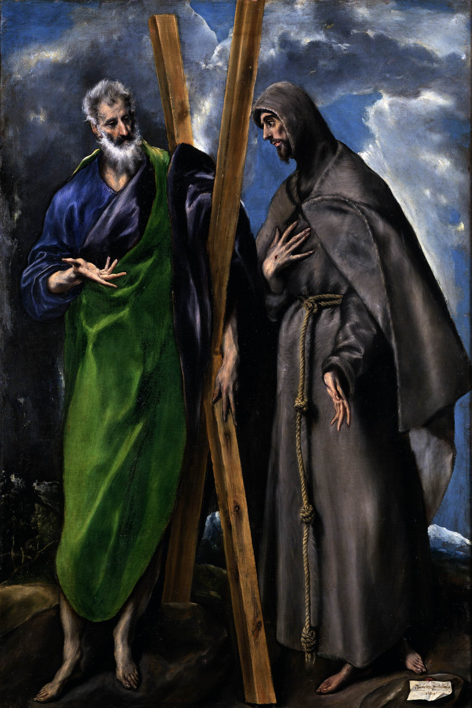

## 基本信息

- 作者：[[埃尔·格列柯 El Greco]]
- 创作年代：1595-1598
- 材质：布面油画 (*not from wiki*)
- 尺寸：167 × 113 cm (*not from wiki*)
- 现存地：马德里普拉多博物馆 (Museo del Prado) (*not from wiki*)

## 画面与技法

[[埃尔·格列柯 El Greco]] [[矫饰主义 Mannerism]] 风格的标志性双人圣徒像——本讲（064）以此样本展示格列柯造型语言的两条形式特征：

1. **不自然的、舞台定格式的动作和神情**——两位圣徒摆出戏剧化的对位姿势，眼神向上或向远处的不可见焦点；
2. **细长到不真实的四肢**——身体比例被显著拉长（约 9-10 头身）。

这两条特征正是 [[毕加索 Pablo Picasso]] 1903 年起在 [[蓝色时期 Blue Period]] 晚期作品（[[老吉他手 The Old Guitarist]]、[[人生 (毕加索) La Vie]] 等）中借鉴的核心。

## 历史背景 (*not from wiki*)

- 绘于格列柯在西班牙托莱多 (Toledo) 全盛期，是其多产的圣徒像系列之一。
- 圣 Andrew（捧 X 形十字架，殉道工具）与圣 Francis of Assisi（手执骷髅与十字架，托钵僧的瘦削形象）按图像志规范配对呈现。

## 图片清单

| 编号 | 出自 | 描述 |
|---|---|---|
| 01 | [[064｜毕加索1：如何理解"蓝色时期"和"玫瑰红时期"？]] | 整幅画面（拉长四肢+舞台定格的矫饰主义样本） |

## 出现在

- [[064｜毕加索1：如何理解"蓝色时期"和"玫瑰红时期"？]]
