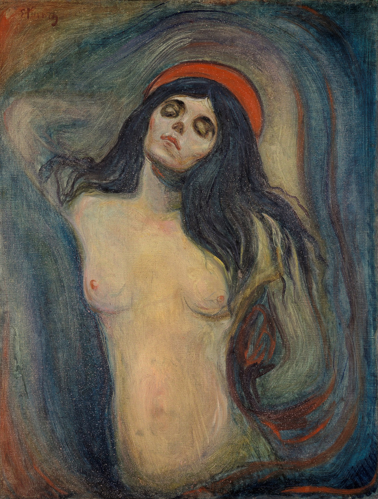

## 基本信息

- 作者：[[爱德华·蒙克 Edvard Munch]]
- 创作年代：1894
- 材质：布面油画 (*not from wiki*)
- 尺寸：约 90 × 68 cm (*not from wiki*)
- 现存地：多版本——奥斯陆 蒙克博物馆 / 挪威国家美术馆 / 汉堡市立美术馆等 (*not from wiki*)

## 画面与技法

顾衡 [[071｜蒙克2：为什么他是表现主义之父？]] 解读：

- "蒙克的这一幅，圣母却**赤裸着上身**，是**一个年轻性感的女人形象**。"
- 蒙克自述："要**画出生命中最圣洁的时刻**"——也就是**受精的时刻**——画完后**蒙克还用自己的精液给这幅画画了个边框**。
- 神学冲突：基督教教义里圣母**无玷始胎**——"根本没有精液什么事儿"——因此有人说蒙克画的不是玛丽亚，而是 **[[莉莉丝 Lilith]]**（亚当夏娃之前的第一个媳妇——*not from wiki* 部分为犹太密教传说）。

蒙克还为此画写了一首诗（071 引用）：

> 你的嘴唇宛若未来般猩红
> 果实四散，犹如感到痛楚
> 死尸绽出微笑
> 生和死双手紧握

属蒙克 [[表现主义 Expressionism]] 时期、以"**女人都是坏东西**"为起点系列中的一件。

## 历史背景 (*not from wiki*)

2004 年蒂芬·彭恩·韦斯特街道蒙克博物馆被蒙面歹徒**当众抢走**此画与 [[呐喊 The Scream]]（071 引用）；此前 1994 年 [[呐喊 The Scream]] 已被偷过一次、1988 年 [[吸血鬼 Vampire]] 也被偷——**蒙克博物馆当时一根绳子往墙上一挂，没有任何安保措施，甚至都没给画上保险**（071 原文吐槽）。

## 图片清单

| 编号 | 出自 | 描述 |
|---|---|---|
| 01 | [[071｜蒙克2：为什么他是表现主义之父？]] | 赤裸上身红发女子 |

## 出现在

- [[071｜蒙克2：为什么他是表现主义之父？]]
