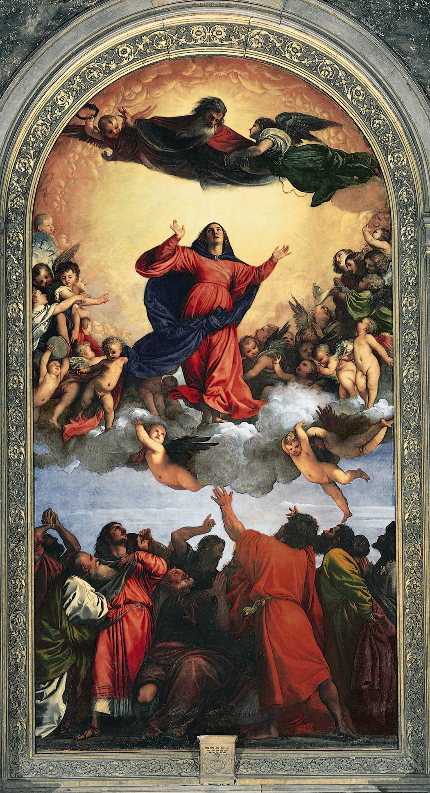

## 基本信息

- 作者：[[提香 Titian]]
- 创作年代：1515–1518
- 材质：木板油画 (*not from wiki*)
- 尺寸：约 690 × 360 cm（祭坛画三层垂直构图） (*not from wiki*)
- 现存地：意大利威尼斯荣耀圣母圣殿 (Santa Maria Gloriosa dei Frari, Venice) (*not from wiki*)

## 画面与技法

垂直三层构图：
- 上层：天父——
- 中层：圣母在云层与小天使群簇拥下**升天**——身披红袍、张开双臂；
- 下层：使徒们朝上仰望，姿态各异——
- 三层用一条**清晰的纵向中轴**统一起来，色彩明暗界限分明。

**顾衡 022 的角色**：作为 [[沃尔夫林 Heinrich Wölfflin]] **"多样性 vs 同一性"**参数的"多样性方"——
> "提香的《圣母升天》，无良版画商还可以把**圣母和小天使一个个抠下来盗用**。可是鲁本斯的圣母，如果从原画中抠下来，却什么都不是了。"

这印证了沃尔夫林对文艺复兴"乐高玩具"式结构的判断：**每一个局部都有一定的独立性**——抠下来仍有意义。

## 历史背景

(*not from wiki*) 1518 年揭幕——提香 28 岁、奠定其在威尼斯画坛领军地位的代表作；威尼斯荣耀圣母圣殿原址展示至今。本作把 [[威尼斯画派 Venetian School]] 的色彩张力推向新的高度。

## 图片清单

| 编号 | 出自 | 描述 |
|---|---|---|
| 01 | [[022｜巴洛克：华丽等于没内涵吗？]] | 整体图（多样性的"乐高玩具"代表） |

## 出现在

- [[022｜巴洛克：华丽等于没内涵吗？]]（沃尔夫林"多样性 vs 同一性"参数的"多样性方"代表）
