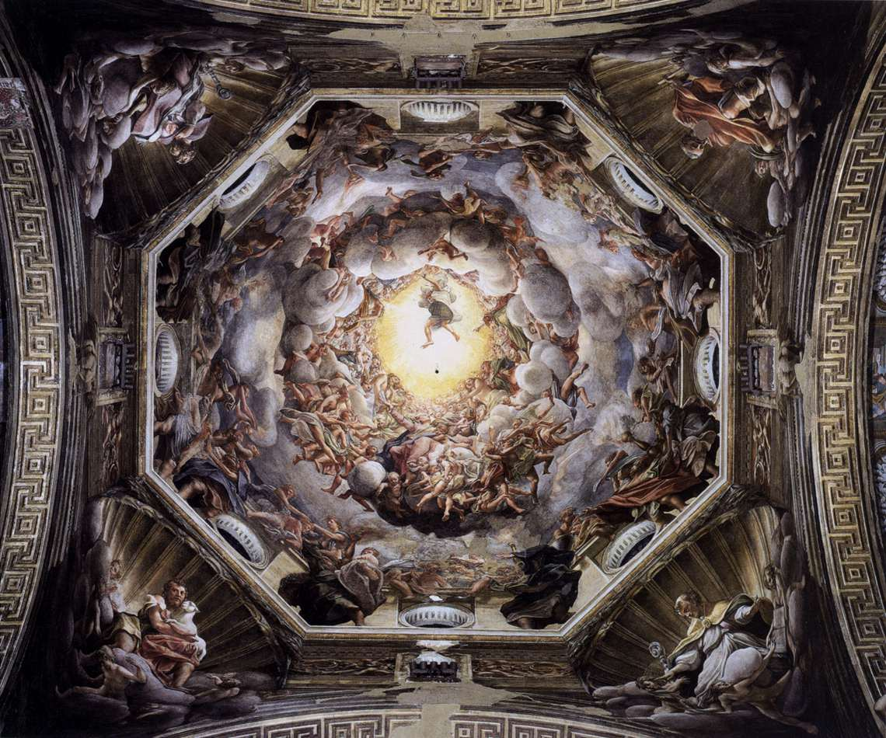
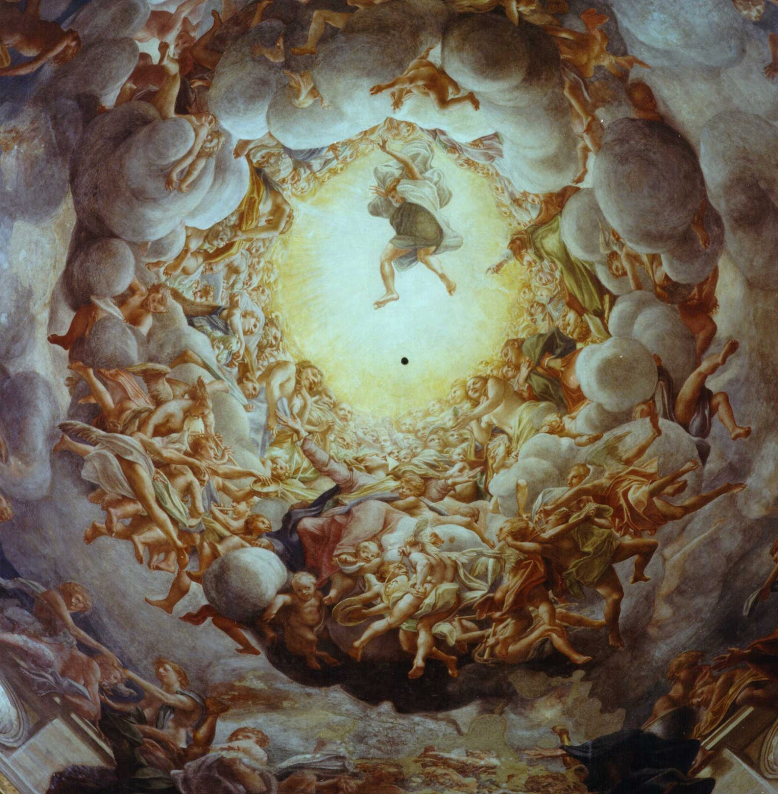

## 基本信息

- 作者：[[科雷乔 Correggio]]
- 创作年代：1526-1530
- 材质：壁画 (穹顶湿壁画)
- 尺寸：穹顶直径约 11 米 (*not from wiki*)
- 现存地：意大利帕尔马大教堂 (Cathedral of Parma) (*not from wiki*)

## 画面与技法

帕尔马大教堂的穹顶画——**第一次从主体角度（仰视）安排画面**的真实空间画：圣母升天的场景，观者只能看到她的脚丫子和悬在空间的两条腿（顾衡："看上去像只青蛙"）。

**顾衡解读**（017）：对照 [[西斯廷天顶画 Sistine Chapel Ceiling]]——
- **米开朗基罗**：上帝和亚当**旋转 90°**正对观者，观者想像自己被电梯抬到与神同高
- **科雷乔**：真实从下向上看——主题被削弱（脚丫子在前）但**空间真实**

为弥补"主题削弱"，科雷乔用了两招：
1. **几百个旁观天使** 挤挤挨挨——单个看像青蛙，堆积成正常秩序
2. **大量云彩** 暗示"天上" + 让天使在云中半隐半现，不必处理天使之间的相对关系

帕尔马大教堂的司铎抱怨："看上去像一大盘炖青蛙肉。" 但这是巴洛克空间革命的精神先驱。

## 图片清单

| 编号 | 出自 | 描述 |
|---|---|---|
| 01 | [[017｜科雷乔：为什么他是文艺复兴最具现代性的画家？]] | 整体图（自下仰视） |
| 02 | [[017｜科雷乔：为什么他是文艺复兴最具现代性的画家？]] | 圣母升天局部 |

## 出现在

- [[017｜科雷乔：为什么他是文艺复兴最具现代性的画家？]]
