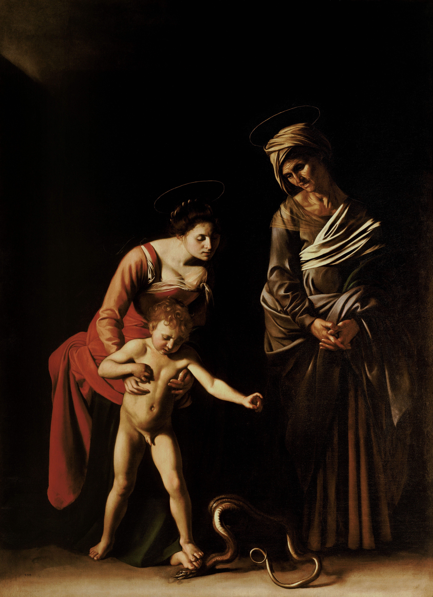

## 基本信息

- 作者：[[卡拉瓦乔 Caravaggio]]
- 创作年代：1605–1606
- 材质：布面油画 (*not from wiki*)
- 尺寸：292 × 211 cm (*not from wiki*)
- 现存地：罗马博尔盖塞美术馆 Galleria Borghese, Rome (*not from wiki*)

## 画面与技法

题材：圣母玛利亚与小耶稣**合力踩死蛇**（代表"原罪"），圣安妮（玛利亚之母）在一旁见证。卡拉瓦乔的标志性技法——**强烈舞台光照、画面背景沉入纯黑、人物从黑暗中"被照亮"出现**。

**画面整体仍属涂绘手法 painterly**——卡拉瓦乔不再用清晰的轮廓线勾勒人体，而是用色块直接塑形。但与 [[鲁本斯 Peter Paul Rubens]] 后期相比，**卡拉瓦乔的轮廓崩溃程度还远没那么彻底**——这是顾衡在 024 中用作对照的关键样本：**同样涂绘，鲁本斯把轮廓崩溃推得更远**。

## 历史背景

(*not from wiki*) 罗马**马夫公会 Confraternity of the Palafrenieri** 为圣彼得大教堂的小礼拜堂订制。圣彼得大教堂当局**不到一周就把画移走**——理由是圣母衣饰过于暴露、小耶稣全裸过大、画面整体过于"世俗"。最终由 Scipione Borghese 枢机收购转入博尔盖塞家族藏品。

这是卡拉瓦乔与教会冲突的早期案例之一——后续 [[圣母之死 The Death of the Virgin]] (1606) 被教会拒收，是更剧烈的爆发（详见 023）。

## 图片清单

| 编号 | 出自 | 描述 |
|---|---|---|
| 01 | [[024｜鲁本斯：都是巴洛克，为什么风格如此不同？]] | "卡拉瓦乔涂绘但轮廓未崩溃"的对照样本 |

## 出现在

- [[024｜鲁本斯：都是巴洛克，为什么风格如此不同？]]
