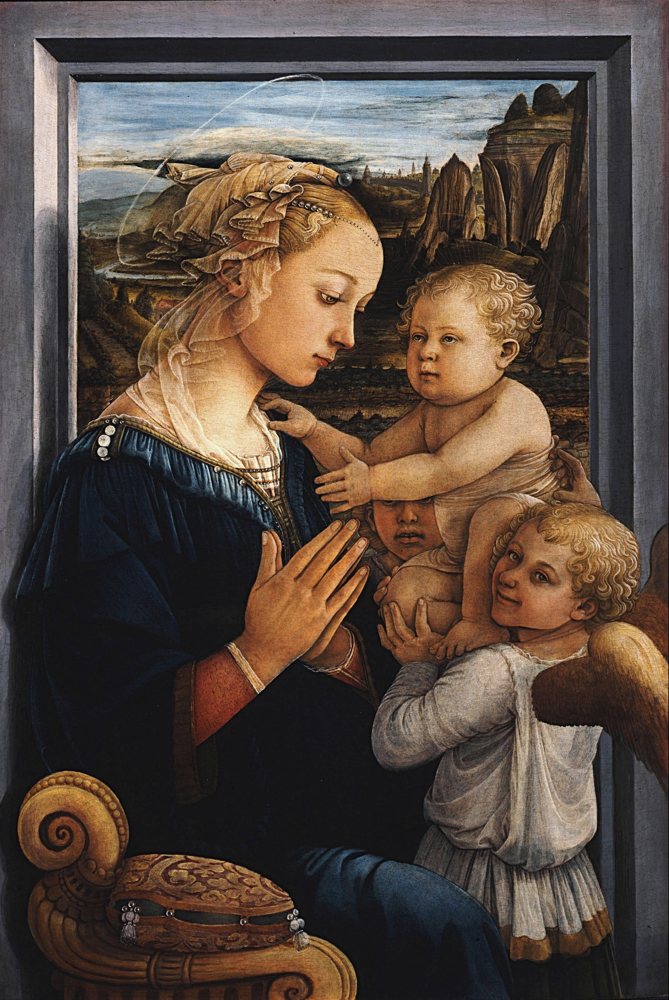

## 基本信息

- 作者：[[利比修士 Filippo Lippi]]
- 创作年代：约 1460–1465 (*not from wiki*)
- 材质：木板蛋彩
- 尺寸：95 × 63.5 cm (*not from wiki*)
- 现存地：佛罗伦萨乌菲齐美术馆 (Galleria degli Uffizi)

## 画面与技法

圣母四分之三侧脸，目光低垂，恬静、虔诚但冷淡——以利比修士拐来的妻子 柳克丽西娅·布蒂 (Lucrezia Buti) 为模特。圣子被两位顽皮小天使举起来面向圣母；前景一道大理石窗台分隔观者与圣母空间；远处风景透出大气透视。

**关键特征**——"**冰美人**"风格：脸型清秀、表情节制、皮肤细腻、没有古典宗教画那种神性距离感，但也没有母性温度——一种**柏拉图式的端庄**。直接影响 [[波蒂切利 Botticelli]] 后期所有圣母像的脸型模板。

## 历史背景

(*not from wiki*) 利比修士此时已被美第奇家族科西莫从修女拐带丑闻中救出，定居佛罗伦萨。画中圣子的天使可能是利比修士与柳克丽西娅的私生子 Filippino Lippi（约 5 岁，那时她已被准许还俗与利比"婚配"）。

顾衡在 [[009｜波蒂切利：如何解读"理念美"？]] 用它说明：波蒂切利"冷淡风"圣母的根源来自师傅，但波蒂切利又往前走了一步——线条更硬、神情更冷漠、更对接柏拉图哲学。

## 图片清单

| 编号 | 出自 | 描述 |
|---|---|---|
| 01 | [[009｜波蒂切利：如何解读"理念美"？]] | 整体图 |

## 出现在

- [[009｜波蒂切利：如何解读"理念美"？]]
