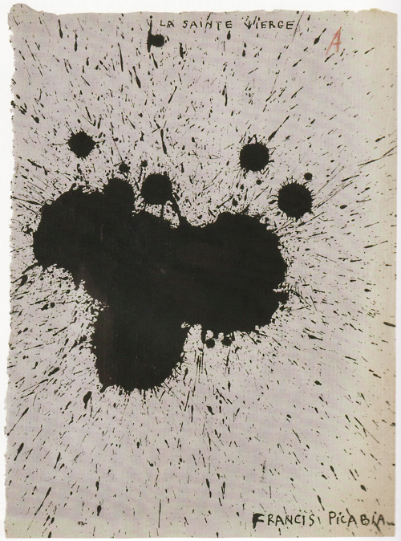

## 基本信息

- 作者：[[毕卡比亚 Francis Picabia]]
- 创作年代：1920
- 材质：纸面油彩 / 印刷 (*not from wiki*)
- 尺寸：年代不详 (*not from wiki*)
- 现存地：私人收藏 (*not from wiki*)

## 画面与技法

[[毕卡比亚 Francis Picabia]] **达达无厘头期**作品——把一团泼洒的墨迹 / 颜料污渍**直接命名为"圣母玛丽亚"**——是对宗教绘画传统最直接的戏谑。

延续 [[杜尚 Marcel Duchamp]] *L.H.O.O.Q.* (1919) 的恶搞思路：让"标题"做主、绘画沦为标题的注脚。

## 历史背景

(*not from wiki*) 1920 年发表在毕卡比亚自办的杂志《391》上。

## 图片清单

| 编号 | 出自 | 描述 |
|---|---|---|
| 01 | [[091｜毕卡比亚：如何用绘画表现达达主义？]] | 整体图 — 墨迹"圣母" |

## 出现在

- [[091｜毕卡比亚：如何用绘画表现达达主义？]]
