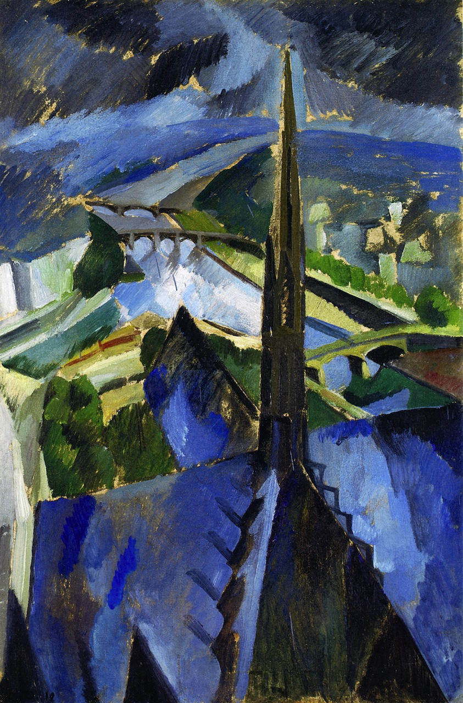
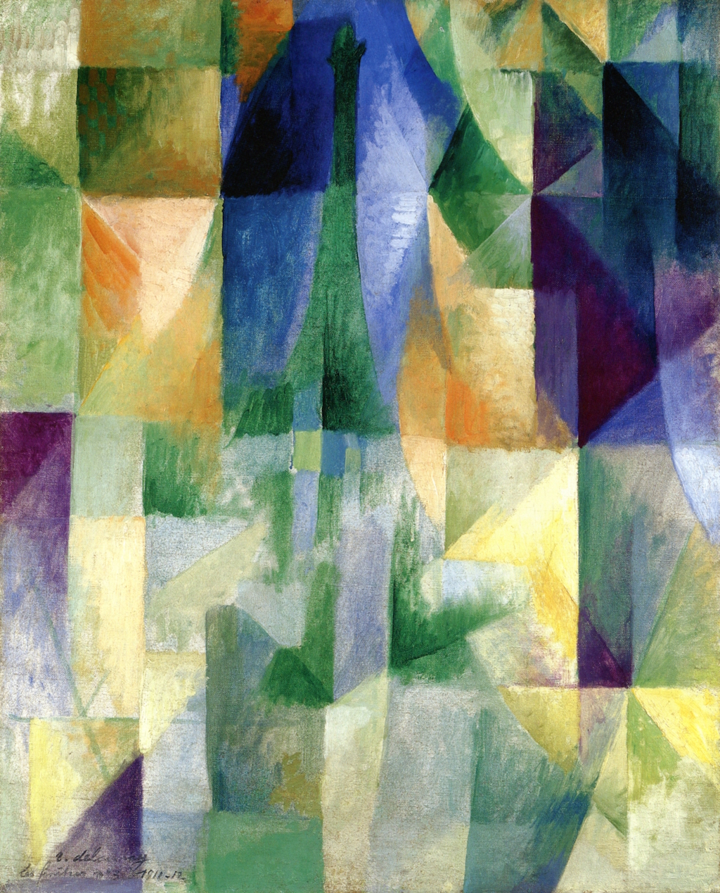

## 基本信息

- 作者：[[德劳内 Robert Delaunay]]
- 创作年代：1909—1912（多件版本，主要 1909–1910 与 1912 两幅；本课程展示两幅）
- 材质：布面油画 (*not from wiki*)
- 尺寸：约 100 × 70 cm (*not from wiki*)
- 现存地：私人收藏 / 巴黎现代艺术博物馆 (*not from wiki*)

## 画面与技法

德劳内**多视角组合**系列的代表母题之一。从下往上仰望巴黎圣母院 (Notre-Dame de Paris) 西立面的尖塔与玫瑰窗——但**不是单一视角**，而是把不同时间、不同角度的视觉印象**叠合**在一张画布上，对应他自创的"**[[同时性绘画 Simultaneous Paintings|同时性绘画]] (Simultanéisme)**"理念。

1912 版色彩更鲜艳、形体更碎、抽象化进一步加剧。

> ⚠️ 本作品所指的是**德劳内的画作**，不应与建筑实体 [[巴黎圣母院 Notre-Dame de Paris]] 混淆。

## 历史背景 (*not from wiki*)

德劳内对哥特尖塔的迷恋贯穿一生——1923 年他和 Sonia 还创作过《巴黎圣母院与圣礼拜堂的尖塔》。这一母题与同期的《[[埃菲尔铁塔 (德劳内) Eiffel Tower|埃菲尔铁塔]]》《[[开向城市的窗 (德劳内) Window on the City|开向城市的窗]]》共同构成"巴黎城市风景"组群。

## 图片清单

| 编号 | 出自 | 描述 |
|---|---|---|
| 01 | [[068｜立体主义，除了毕加索还值得了解什么？]] | 1909—1910 版 |
| 02 | [[068｜立体主义，除了毕加索还值得了解什么？]] | 1912 版；形体更碎、色彩更鲜 |

## 出现在

- [[068｜立体主义，除了毕加索还值得了解什么？]] —— "巴黎城市风景"母题
