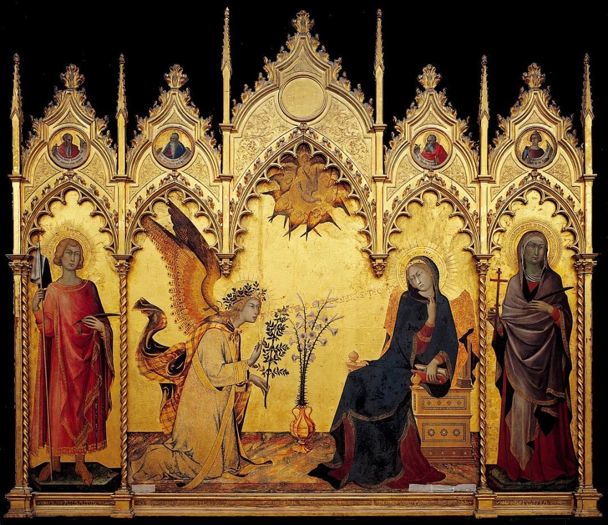
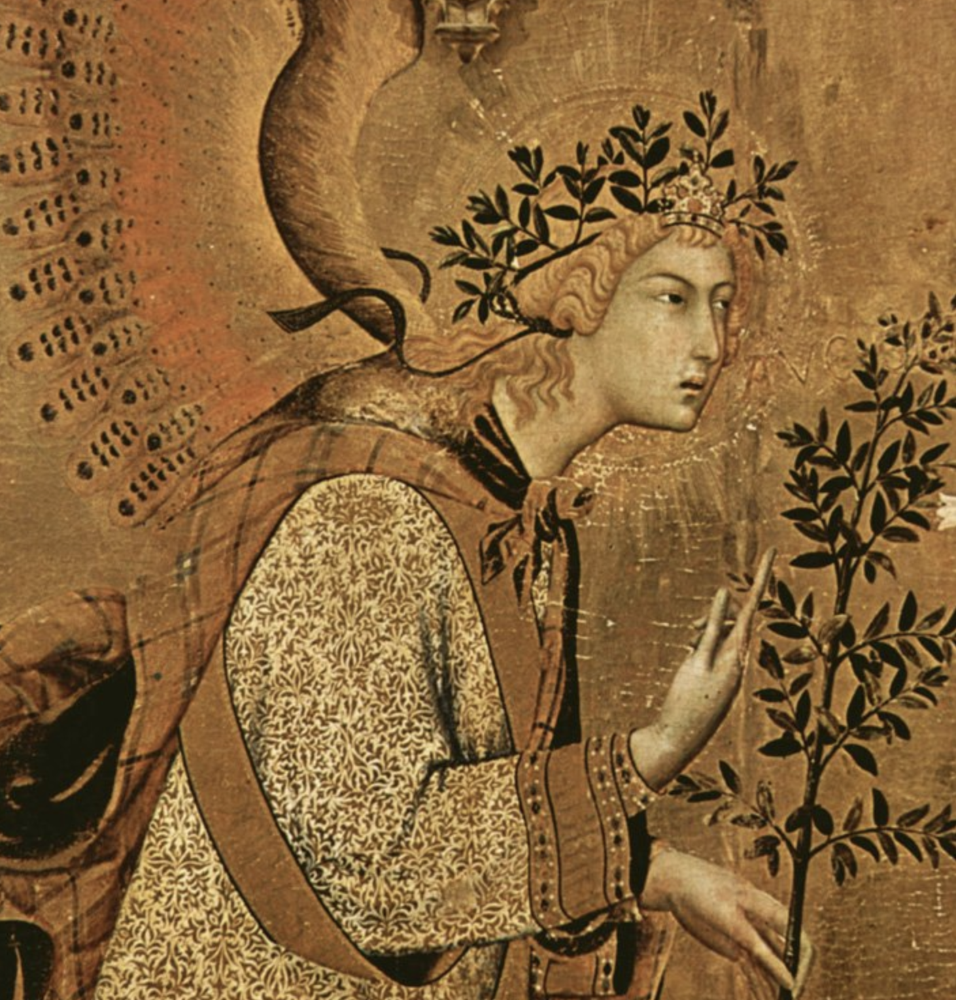
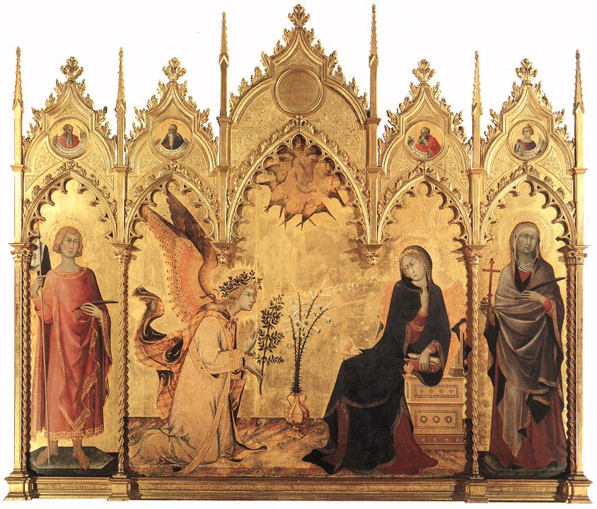
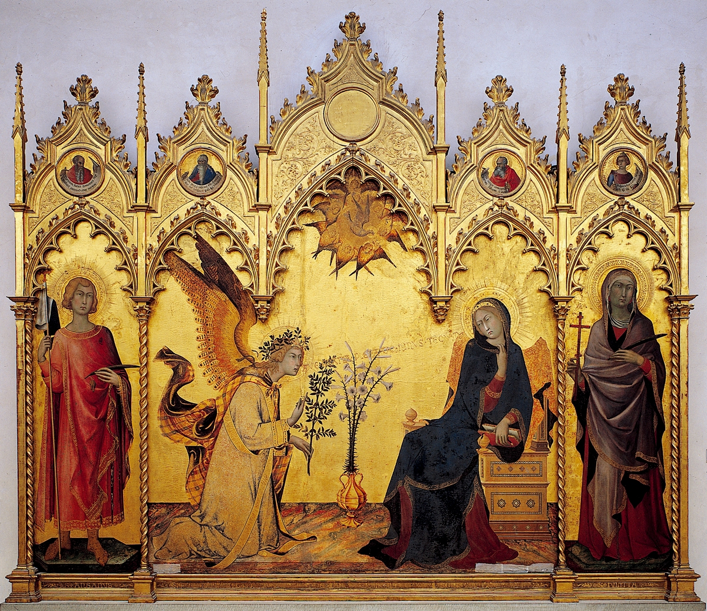

## 基本信息

- 作者：[[马丁尼 Simone Martini]] 与利波·梅米 (Lippo Memmi)
- 创作年代：1333 (*not from wiki*)
- 材质：木板蛋彩、金底 (tempera and gold on panel) (*not from wiki*)
- 尺寸：184 × 210 cm（三联画）(*not from wiki*)
- 现存地：原置锡耶纳主教堂 (Duomo di Siena) 圣安萨诺礼拜堂；今藏佛罗伦萨乌菲齐美术馆 (*not from wiki*)

## 画面与技法

中央三联式构图：

- **左**：大天使加百列单膝跪地，刚刚降下，斗篷被风吹起，手中持一束橄榄枝；
- **右**：圣母玛利亚坐在宝座上读书，听到天使报喜的话扭过身去，半惊半疑；
- 两者之间一只白色花瓶里插着百合（圣洁的象征）；
- 上方一只白鸽（圣灵）；
- 整个背景是**纯金底**，没有任何空间纵深；
- 加百列的话语从他口中**用真实金字写出来**飘向圣母：*Ave gratia plena Dominus tecum*（"万福，主与你同在"）。

形式特征——纤细修长的人物轮廓、波浪状的衣褶、华丽的金底、强调表面装饰而非空间纵深——是 **锡耶纳画派 + 国际哥特风格** 的标志。

## 历史背景

(*not from wiki*) 1333 年为锡耶纳主教堂的圣安萨诺礼拜堂创作。马丁尼负责中央两位主角，梅米负责两侧的圣徒。1799 年被拿破仑军队拆走运往法国，后归还意大利时被分散收藏；1900 年代重组为乌菲齐展品。

顾衡在 [[003｜画得像和画得好是一回事吗？]] 用它做开场例子：**14 世纪的中世纪欧洲绘画"画得也是一点儿都不像"**——金底、扁平、线条化、装饰化。如果用"画得像 = 画得好"的尺子去量，这件作品就成了"中世纪手艺退化"的证据。但顾衡借此引出本课论点：**这是不为，不是不能**——画家的选择服从于教会的传播任务，不是技术不够。

更完整的解读将在 [[005｜哥特艺术1：为什么说它是文艺复兴的前奏？]] / [[006｜哥特艺术2：为什么在意大利发生了分化？]] 中处理。

## 图片清单

| 编号 | 出自 | 描述 |
|---|---|---|
| 01 | [[003｜画得像和画得好是一回事吗？]] / [[006｜哥特艺术2：为什么在意大利发生了分化？]] | 三联整体图（两课配图为同一文件 MD5） |
| 02 | [[006｜哥特艺术2：为什么在意大利发生了分化？]] | 局部：加百列衣物上的中国织金锦细节 |
| 03 | [[009｜波蒂切利：如何解读"理念美"？]] | 整体图（不同 CDN 版本，与 01 异 MD5） |

## 出现在

- [[003｜画得像和画得好是一回事吗？]]
- [[006｜哥特艺术2：为什么在意大利发生了分化？]]（锡耶纳派的最高水准代表；加百列穿中国织金锦的细节作为东西艺术交流的可能物证）
- [[009｜波蒂切利：如何解读"理念美"？]]（作为对照作品：马丁尼程式化但表情生动 vs. 波蒂切利圣母领报更写实但表情淡漠）
