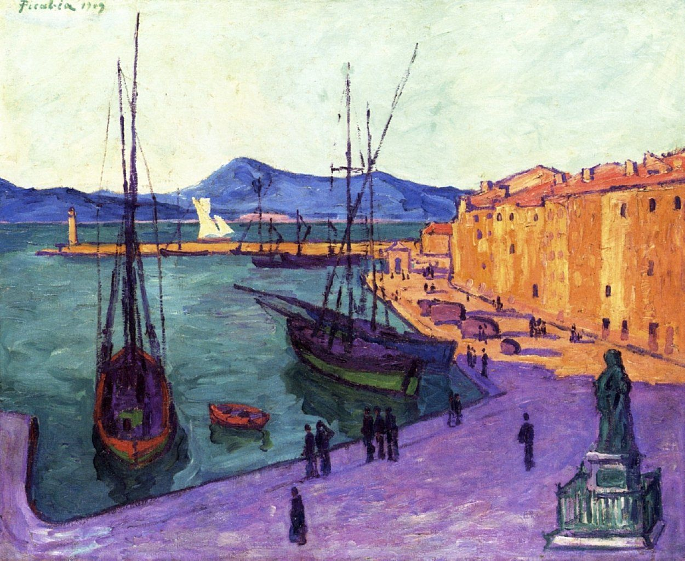

## 基本信息

- 作者：[[毕卡比亚 Francis Picabia]]
- 创作年代：1909
- 材质：布面油画 (*not from wiki*)
- 尺寸：年代不详 (*not from wiki*)
- 现存地：私人收藏 (*not from wiki*)

## 画面与技法

[[毕卡比亚 Francis Picabia]] **野兽派尝试期**作品——圣特罗佩是法国南部地中海小港，[[西涅克 Paul Signac]] (*not from wiki*) 和野兽派画家 (马蒂斯/克罗斯) 早年集中创作之地。毕卡比亚试图加入野兽派对话，"但并没有引起什么反响"。

## 历史背景

(*not from wiki*) 1909 年正值野兽派内部分化、马蒂斯开始转向、其他成员陆续散去的关键年。

## 图片清单

| 编号 | 出自 | 描述 |
|---|---|---|
| 01 | [[091｜毕卡比亚：如何用绘画表现达达主义？]] | 整体图 — 黄昏圣特罗佩港的野兽派笔触 |

## 出现在

- [[091｜毕卡比亚：如何用绘画表现达达主义？]]
