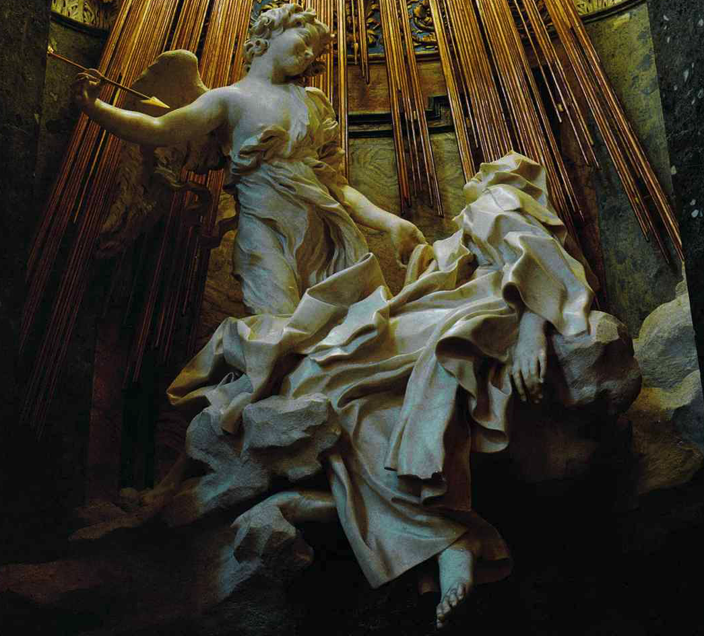
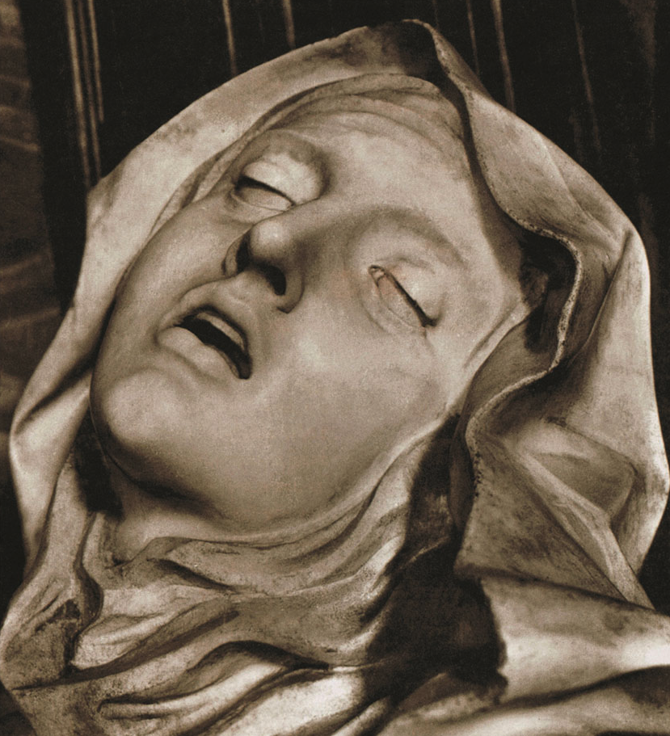
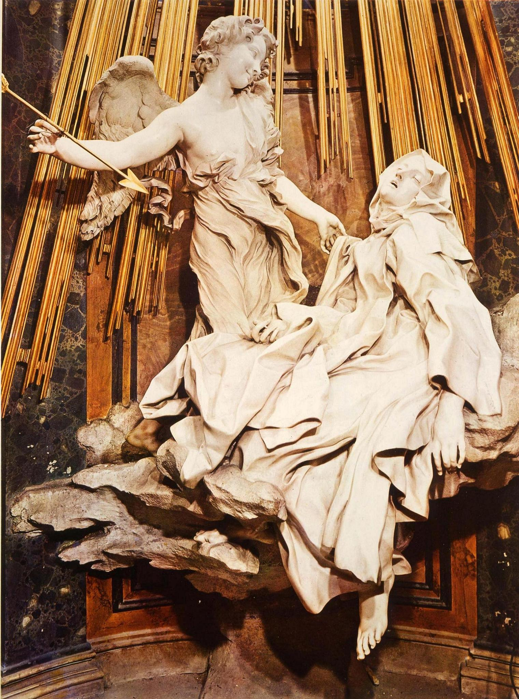

## 基本信息

- 作者：[[贝尔尼尼 Bernini]]
- 创作年代：1645–1652 (*not from wiki*)
- 材质：大理石（雕塑）+ 镀金铜（光束 / 太阳）+ 多色大理石（壁龛、舞台框架）
- 尺寸：人物组高约 3.5 m (*not from wiki*)
- 现存地：意大利罗马 圣母玛利亚-胜利教堂 (Santa Maria della Vittoria) 科尔纳罗礼拜堂 (Cornaro Chapel)

## 画面与技法

戏剧性两人组雕：

- 圣特蕾莎（西班牙修女、神秘主义者）**斜躺在云上、半睡半醒、头后仰、嘴唇微张、衣袍翻卷成翻腾的浪**；
- 一位天使**面带微笑、手持金箭**，将刺向她的胸口；
- 背景**镀金铜光束**从顶部洒下；
- 整个组合置于多色大理石**舞台式壁龛**中，两侧大理石"包厢"里坐着委托家族的成员——观者观看圣特蕾莎，就像剧院里观众观看舞台。

**圣特蕾莎在自传中描述**：天使用火箭刺她的心，痛苦极甜美，是与神合一的瞬间。贝尔尼尼把这个**身体感受 vs. 神性合一**的瞬间凝固——表情几乎不可与世俗的"性爱高潮"区分开。

008 顾衡引此作为 [[仰望星空母题 (出神) Star-gazing Motif]] 在巴洛克的极致——"虽说是人心不古、世风日下，越往后越是肉欲横流。但是其背后，却都是天主教教会将柏拉图哲学与天主教教义进行整合的努力。"

## 历史背景

(*not from wiki*) 贝尔尼尼为科尔纳罗家族的礼拜堂创作；威尼斯贵族 Federico Cornaro 红衣主教委托。本作被视为意大利 [[巴洛克 Baroque]] 雕塑的巅峰之一，也是反宗教改革（Counter-Reformation）"用感官冲击恢复天主教权威"策略的标志性图像。

## 图片清单

| 编号 | 出自 | 描述 |
|---|---|---|
| 01 | [[008｜文艺复兴到底复兴了什么？]] | 整体图（含光束与壁龛） |
| 02 | [[008｜文艺复兴到底复兴了什么？]] | 圣特蕾莎面部特写 |

## 出现在

- [[008｜文艺复兴到底复兴了什么？]]
