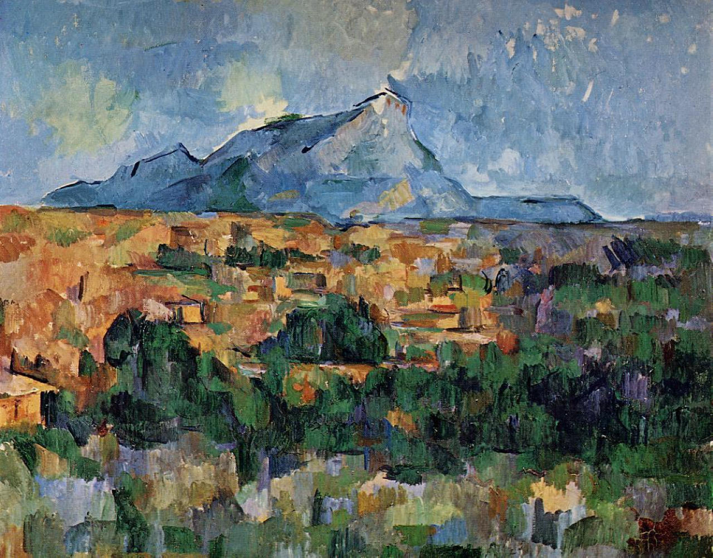
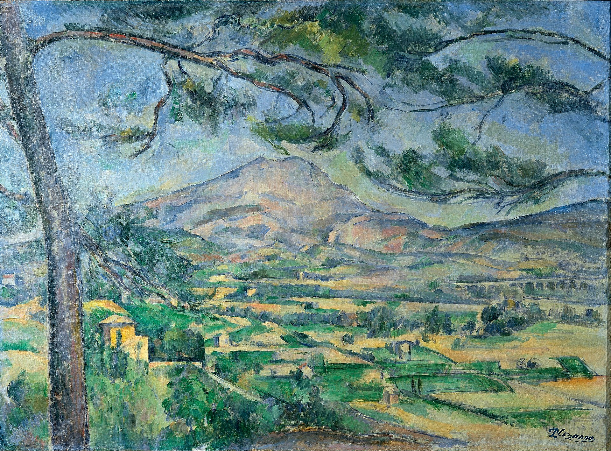
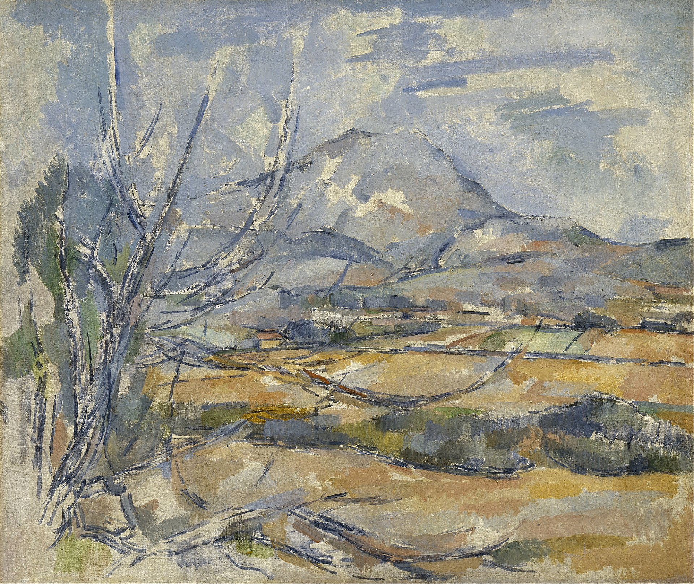
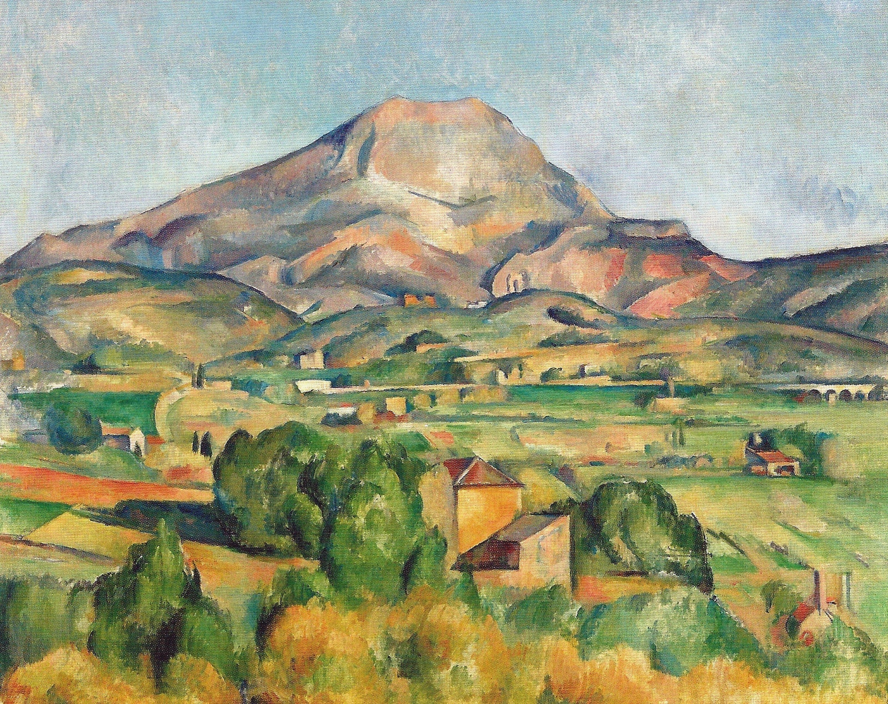
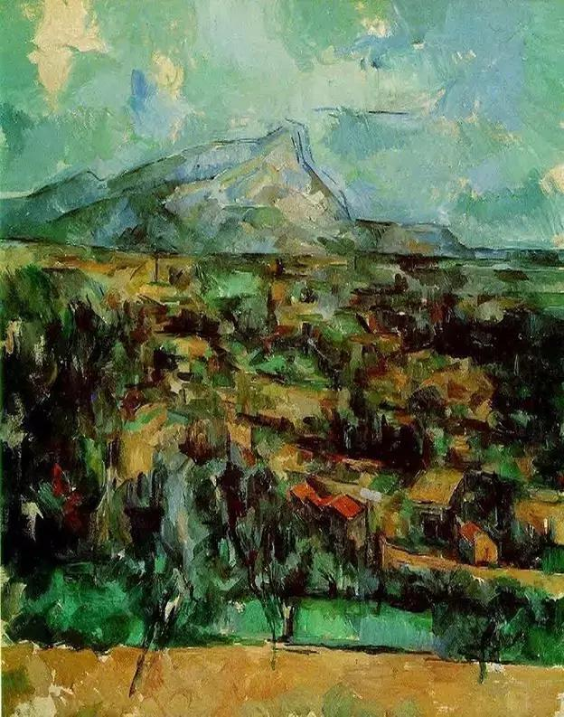
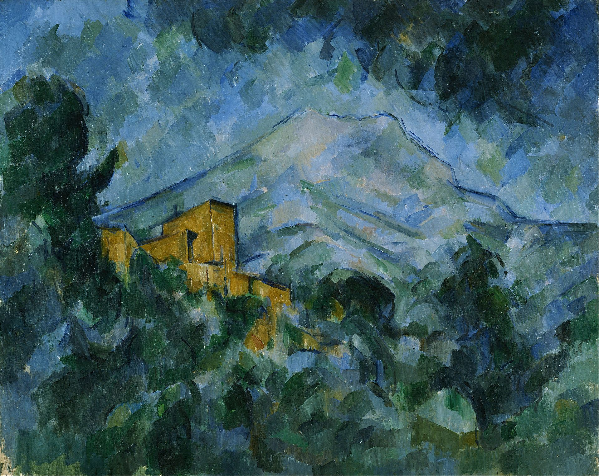

## 基本信息

- 作者：[[塞尚 Paul Cézanne]]
- 创作年代：1904-1906（晚期系列；顾衡 053 选用版本）
- 材质：油彩，画布 (*not from wiki*)
- 尺寸：(*not from wiki*) 约 73 × 91 cm（典型晚期版本）
- 现存地：(*not from wiki*) 不同版本分藏于费城艺术博物馆、苏黎世美术馆、巴塞尔美术馆等

## 画面与技法

[[塞尚 Paul Cézanne]] **[[主观色彩序列 Subjective Colour Sequence|主观色彩序列]]营造纵深**的成熟样本——顾衡 053 用本作论证塞尚抛弃[[线性透视 Linear Perspective|透视法]]后的解决方案：

- **没有传统的色差过渡和光影效果**
- **一个个独立的色块彼此简单排列、却仍然能表现出纵深**

操作原理：**按从明到暗的色彩序列来安排画面**。塞尚的颜色选择是**主观的**——他关心的并不（仅）是眼睛所见的真实颜色，每个块面选择什么颜色、什么明暗，都**服务于产生纵深**。

塞尚崇拜者 [[贝尔纳 Émile Bernard]] 的实地观察："**塞尚先在阴影处画一笔，随后以较大的第二笔覆盖上去，跟着是第三笔，直到所有这些色彩，如同百叶窗一般的层次，将物象以色彩赋形。他必然是如从前织锦工匠一样，把相关的色彩安排成一个序列，直到它们获得色彩的对比。**"

塞尚自述："**绘画中最重要的事情是找出正确的距离，只有色彩才能表达深度中的所有变化**。"

## 历史背景 (*not from wiki*)

圣维多利亚山（海拔 1,011 米）位于普罗旺斯艾克斯城东，是塞尚晚年家乡风景中的核心母题——1880s 到 1906 去世前，他至少画了 **60 余幅油画 + 水彩**，从不同距离、不同时间、不同视角反复推敲。该系列是 20 世纪艺术史公认的**塞尚最高成就**——立体主义、抽象艺术从中各取其所需的开端。

## 图片清单

| 编号 | 出自 | 描述 |
|---|---|---|
| 01 | [[053｜塞尚2：如何打造艺术的平行世界？]] | 全图——主观色彩序列营造纵深的成熟样本 |

## 出现在

- [[053｜塞尚2：如何打造艺术的平行世界？]] —— 主观色彩序列营造纵深的成熟样本
