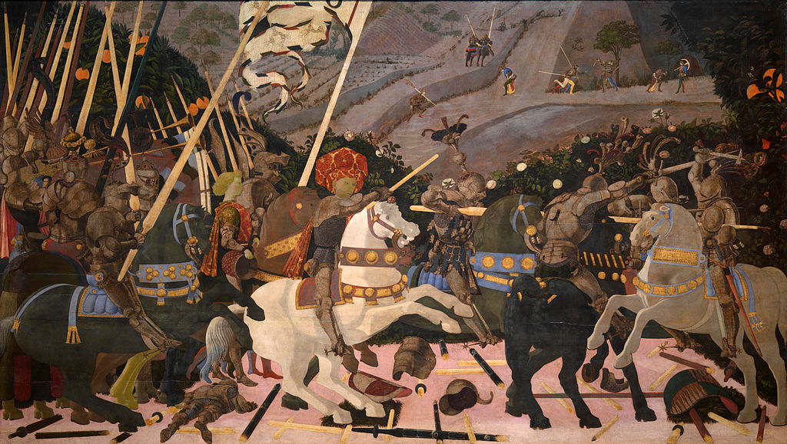

## 基本信息

- 作者：[[乌切洛 Paolo Uccello]]
- 创作年代：1438-1440（三联画的中间一块）
- 材质：木板蛋彩
- 尺寸：约 182 × 320 cm 每块 (*not from wiki*)
- 现存地：三联画分藏卢浮宫、乌菲齐、伦敦国家画廊 (*not from wiki*)

## 画面与技法

1432 年佛罗伦萨在圣罗马诺击败锡耶纳的战役场景。**地上散落的折断长矛**与战马姿势构成乌切洛的几何透视实验场。

**顾衡解读**（017）：乌切洛**痴迷数学**，出于形式美感把消失点分别放在地平线**最左**与**最右**两端——这是对单中心透视的"形式美"修正，但顾衡评："搞得再花花，也还是个几何模型——把馒头改成花卷并不解决问题。"

## 图片清单

| 编号 | 出自 | 描述 |
|---|---|---|
| 01 | [[017｜科雷乔：为什么他是文艺复兴最具现代性的画家？]] | 整体图 |

## 出现在

- [[017｜科雷乔：为什么他是文艺复兴最具现代性的画家？]]
