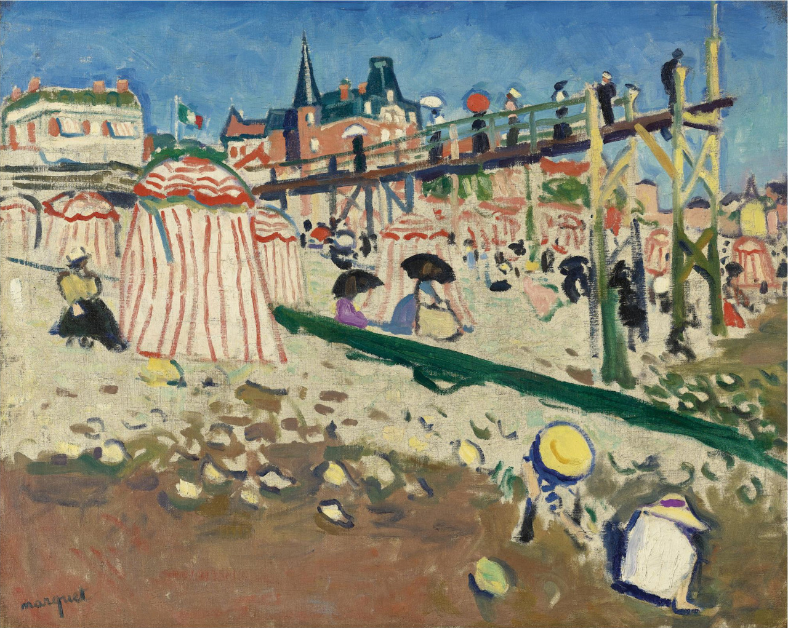

## 基本信息

- 作者：[[马尔凯 Albert Marquet]]
- 创作年代：1906
- 材质：油彩，画布 (*not from wiki*)
- 现存地：(*not from wiki*)

## 画面与技法

[[马尔凯 Albert Marquet]] **混搭风格代表作**（060 明示）—— 与同时期 [[马蒂斯 Henri Matisse]]《[[画室中的裸女 Decorative Figure]]》共享"塞尚式 + 点彩派背景"的混搭。060 用以展示马蒂斯+马尔凯**1899–1906 同期"战友"群体**的共同探索。

## 历史背景 (*not from wiki*)

圣阿德莱斯 (Sainte-Adresse) 位于诺曼底海岸 Le Havre 附近，是 19 世纪后期画家常去的写生地点（[[莫奈 Claude Monet]] 1867《圣阿德莱斯的花园露台》是著名先例）。

## 图片清单

| 编号 | 出自 | 描述 |
|---|---|---|
| 01 | [[060｜马蒂斯1：野兽派从何而来？]] | 全图——与马蒂斯共享的混搭风格样本 |

## 出现在

- [[060｜马蒂斯1：野兽派从何而来？]]
