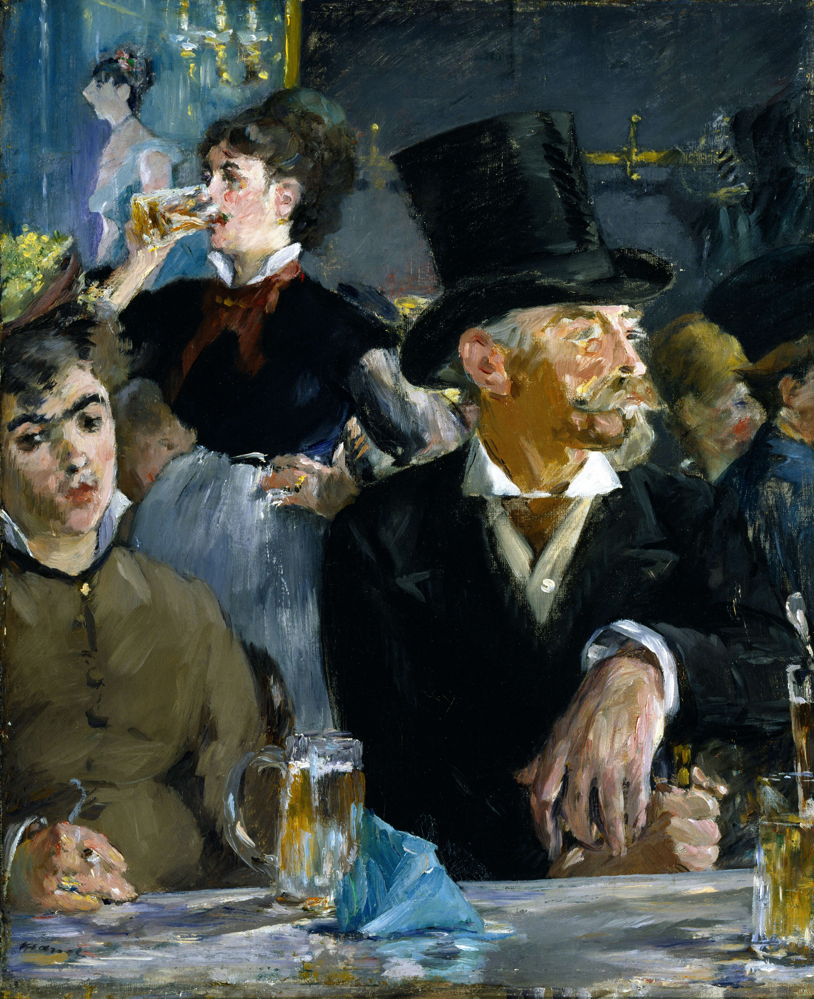

## 基本信息

- 作者：[[马奈 Édouard Manet]]
- 创作年代：1879
- 材质：油彩，画布 (*not from wiki*)
- 尺寸：47.5 × 39.2 cm (*not from wiki*)
- 现存地：温特图尔奥斯卡·莱因哈特收藏 Oskar Reinhart Collection, Winterthur (*not from wiki*)

## 画面与技法

[[马奈 Édouard Manet]] 笔下巴黎咖啡馆里的一对男女与远处的女招待。画面切割带有摄影感的随意构图——人物半被构图边缘截断 (*not from wiki*)。被顾衡用来举证 [[画廊与经纪人体系 Gallery and Dealer System]] 浮现 + 传统熟人订制萎缩之后，新型城市公共空间（咖啡馆）成为现代生活与画家观察的核心舞台。

## 历史背景 (*not from wiki*)

马奈晚年大量画咖啡馆题材，与同期印象派的德加、雷诺阿等共享这一主题。咖啡馆是 [[奥斯曼男爵 Baron Haussmann]] [[巴黎大改造 Haussmann's renovation of Paris]] 之后林荫大道两旁兴起的新型陌生人社交场所。

## 图片清单

| 编号 | 出自 | 描述 |
|---|---|---|
| 01 | [[038｜马奈1：为什么他是西方现代绘画的鼻祖？]] | 全图 |

## 出现在

- [[038｜马奈1：为什么他是西方现代绘画的鼻祖？]]
