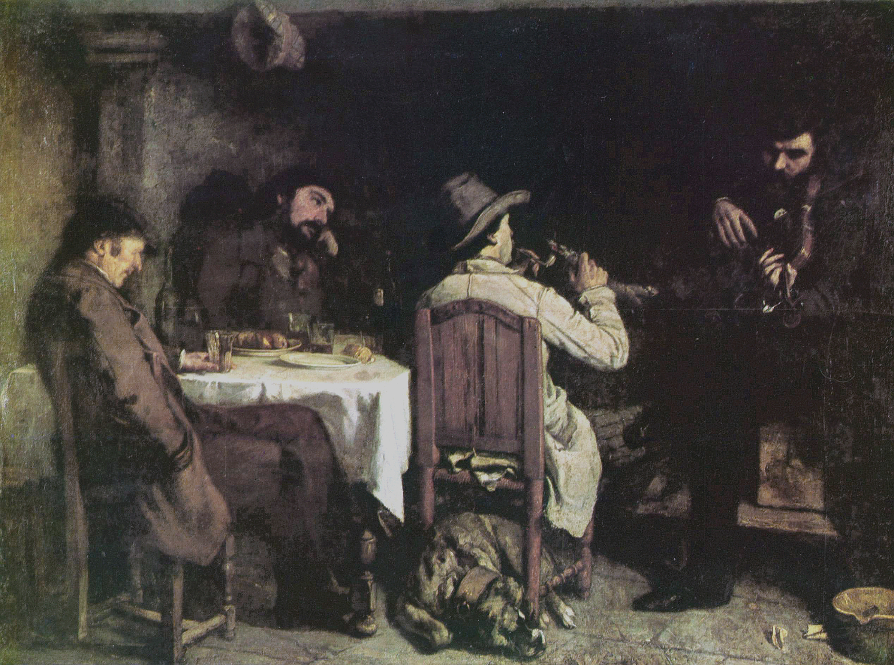

## 基本信息

- 作者：[[居斯塔夫·库尔贝 Gustave Courbet]]
- 创作年代：1848–1849
- 材质：布面油画 (*not from wiki*)
- 尺寸：约 195 × 257 cm (*not from wiki*)
- 现存地：里尔美术宫 Palais des Beaux-Arts de Lille (*not from wiki*)

## 画面与技法

库尔贝家乡奥尔南的一次餐后场景——四位男士围桌而坐，一人吹笛、一人沉思、一人倾听。**学院派标准下被视为庸常 / 不入题材**——但库尔贝把它放在大尺幅油画的正中。

## 历史背景

(*not from wiki*) 这幅画在 **1849 沙龙拿过二等奖章**——是库尔贝**在官方沙龙获得的最高成就**（顾衡 035 明示）。1844 起送沙龙、近十年只入选三四幅的库尔贝凭此获得短暂的官方承认。

## 图片清单

| 编号 | 出自 | 描述 |
|---|---|---|
| 01 | [[035｜库尔贝：为什么现实主义的开创者争议那么大？]] | 全幅，餐桌围坐场景 |

## 出现在

- [[035｜库尔贝：为什么现实主义的开创者争议那么大？]]
