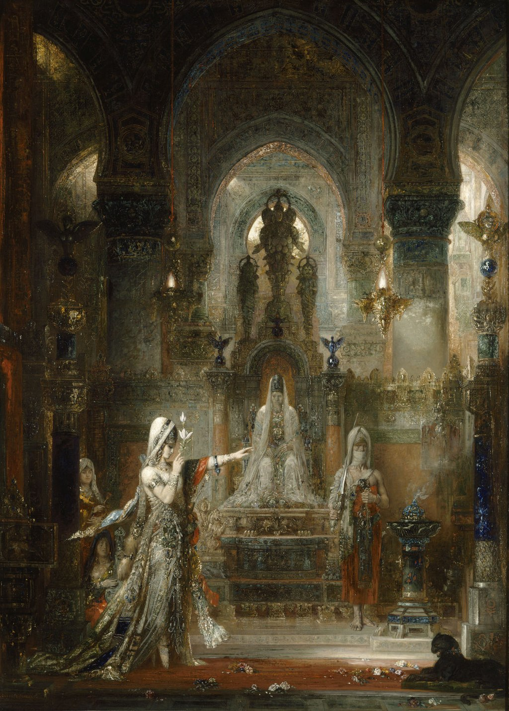

## 基本信息

- 作者：[[莫罗 Gustave Moreau]]
- 创作年代：1876
- 材质：油彩 / 画布 (*not from wiki*)
- 尺寸：143.5 × 104.3 cm (*not from wiki*)
- 现存地：(*not from wiki*) 美国 哈默博物馆（Armand Hammer Collection, UCLA Hammer Museum）

## 画面与技法

莫罗"**女人是老虎**"母题的代表作之一——莎乐美在希律宫殿熏香的邪恶气味中徐步前行，伸展左臂下命令的姿势、举至面前的莲花、繁复装饰的宫殿建筑、地面布满符号化的精致花纹——画面**精致、神秘、复杂，充满与主题毫不相干的细节**，这正是 [[象征主义 Symbolism]] **朦胧路径**所追求的"有意思又猜不透"。莫罗在此把"奢华"、"歇斯底里"、"可诅咒的美"、"毒化一切的危险性"等抽象观念**附身**在莎乐美形象上——观看者只能感知到氛围而无法完成"翻译"。

## 历史背景

(*not from wiki*) 1876 年首展即引起轰动；同年 [[于斯曼 Joris-Karl Huysmans]] 在 1884 年出版的小说《[[逆流 À rebours]]》中以本作为重点描写对象——主人公 [[于斯曼 Joris-Karl Huysmans|德塞森特]] 凝视此画的段落成为颓废派经典文学场景，将 [[莫罗 Gustave Moreau]] 推向声名巅峰。

于斯曼《逆流》评本作（*from this source*）：

> 在熏香的邪恶气味中，莎乐美伸展左臂，做出一个下命令的姿势。她踮起脚尖、右臂弯曲，将一朵大莲花举到脸孔的高度，按照蹲在侧旁的女子弹拨琴弦的节拍，徐徐前行……从某种意义上说，她是从所有女人中被选出的，成了不可摧毁的奢华的神圣象征，成了不朽的歇斯底里女神，成了可诅咒的美神。她如野兽魔怪，无动于衷，冷若冰霜，她毒化靠近她的一切……

## 图片清单

| 编号 | 出自 | 描述 |
|---|---|---|
| 01 | [[050｜莫罗：象征主义绘画为什么走向朦胧？]] | 1876 全图——莎乐美起舞瞬间 |

## 出现在

- [[050｜莫罗：象征主义绘画为什么走向朦胧？]]
