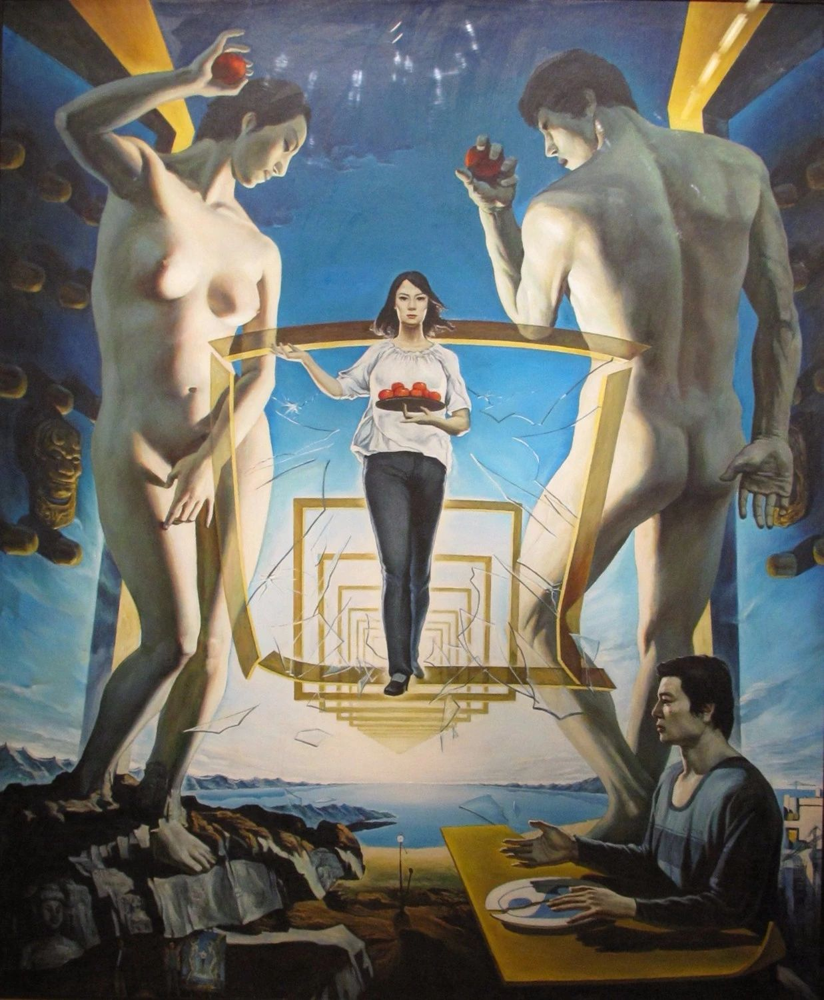

## 基本信息

- 作者：[[孟禄丁 Meng Luding]] / [[张群 Zhang Qun]] (合作)
- 创作年代：1985
- 材质：布面油画 (*not from wiki*)
- 尺寸：(*not from wiki*)
- 现存地：(*not from wiki*) —— "[[八五新潮 '85 New Wave]]" 运动代表作

## 画面与技法

中国 "**[[八五新潮 '85 New Wave]]**" 运动代表作。画面构成：

- **裸体的男女** —— 亚当与夏娃，代表 **西方文明**；
- **中国当代女青年**，端着一盘苹果，款款走来；
- **画面右下角的中国年轻人**，守着一个 **裂开的太极盘**，一脸迷茫和困惑。

**亚当夏娃、苹果、破碎佛像、太极盘**——所有元素都像 **密电码一样清晰**——表达了 **西方文明对中国古老文明的冲击**。

顾衡在 [[049｜夏凡纳：如何制作象征主义的密电码？]] 中指出：此画 **常被和超现实主义联系在一起**（表现形式上一定程度借鉴达利），**但与梦境丝毫扯不上关系**——**它反映的就是那一代年轻艺术家真实的思想状态**——所以这是 **一幅典型的象征主义绘画**，而非超现实主义。

## 历史背景 (*not from wiki*)

"八五新潮"是 1985 年前后中国艺术界发起的现代艺术运动，反对当时学院派占主导地位的现实主义绘画。本画是该运动的标志性作品之一，1985 年首次展出后引发广泛讨论，成为中国 1980 年代"文化反思"思潮的视觉符号。

## 图片清单

| 编号 | 出自 | 描述 |
|---|---|---|
| 01 | [[049｜夏凡纳：如何制作象征主义的密电码？]] | 整幅画面 |

## 出现在

- [[049｜夏凡纳：如何制作象征主义的密电码？]] —— 作为 **中国当代象征主义正例** 被顾衡引用
