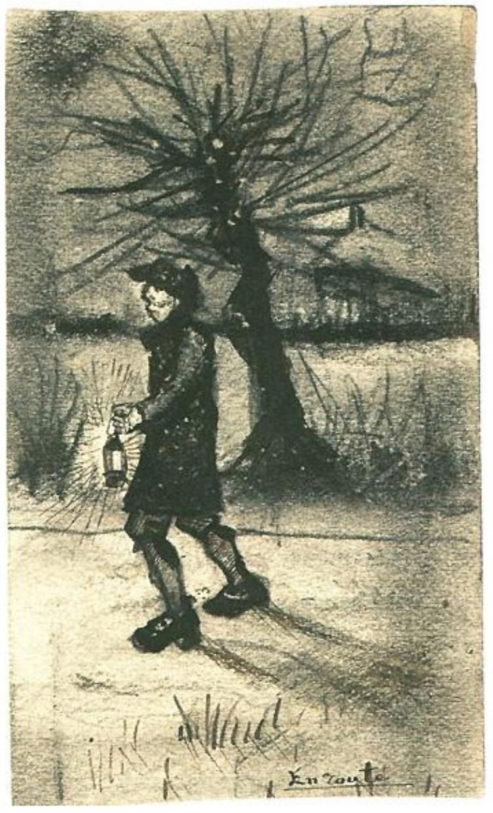

## 基本信息

- 作者：[[凡·高 Vincent van Gogh]]
- 创作年代：1881
- 材质：素描 (*not from wiki*)
- 尺寸：—
- 现存地：—

## 画面与技法

凡·高早期素描，行旅人物题材。057 caption 作"在路上"，正文行文一处作"在途中"。

## 历史背景 (*not from wiki*)

凡·高 1881 年在荷兰乡村定居期间所作素描，延续他对底层劳动者、行旅者的关注脉络。

## 图片清单

| 编号 | 出自 | 描述 |
|---|---|---|
| 01 | [[057｜凡·高1：为什么说他"性格决定命运"？]] | 凡·高 1881 年素描《在路上》 |

## 出现在

- [[057｜凡·高1：为什么说他"性格决定命运"？]]
