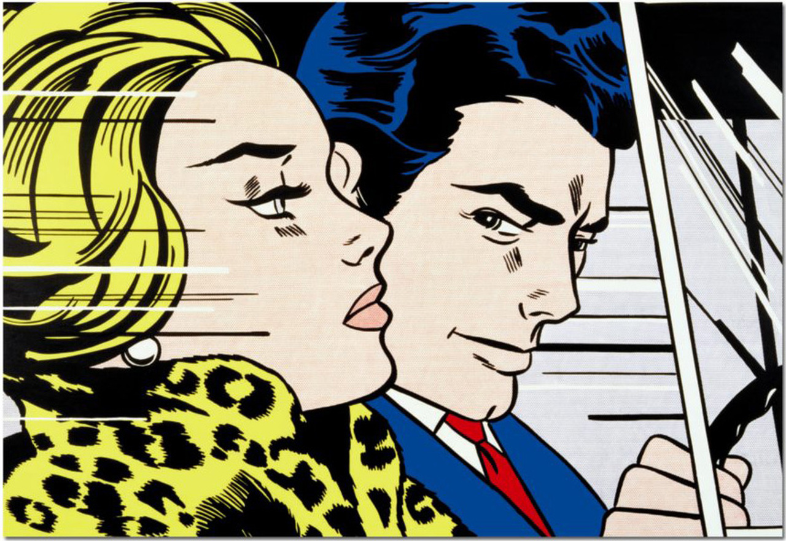

## 基本信息

- 作者：[[罗伊·利希滕斯坦 Roy Lichtenstein]]
- 创作年代：1963
- 材质：（*not from wiki*）油彩与马格纳颜料于画布
- 尺寸：（*not from wiki*）172 × 203.5 cm
- 现存地：（*not from wiki*）苏格兰国家美术馆 National Galleries of Scotland

## 画面与技法

把战后浪漫题材连环画里的某一格——**男女主角驾车并坐，女主角侧脸向远方**——直接放大成画。保留漫画的：

- Ben-Day **网点**（背景天空 / 头发阴影）
- **粗黑描边**
- **大色块原色平涂**
- **侧光下二人神情张力**

利希滕斯坦的标志性手法——顾衡 098 类比："你看看现在的表情包，是不是跟他也有类似之处？"

## 历史背景 (*not from wiki*)

- 1963 是利希滕斯坦最高产的一年；这幅画与 [[哭泣的女孩 (利希滕斯坦) Crying Girl]] 同年——一动一静、一男女对手戏一女性独白，构成情感叙事张力的两个极。
- 2005 年此画拍出 1620 万美元，2015 年再拍 4520 万美元，曾是利希滕斯坦最贵作品之一。

## 图片清单

| 编号 | 出自 | 描述 |
|---|---|---|
| 01 | [[098｜波普艺术：流行文化如何成为艺术？]] | 作品全图 |

## 出现在

- [[098｜波普艺术：流行文化如何成为艺术？]]
