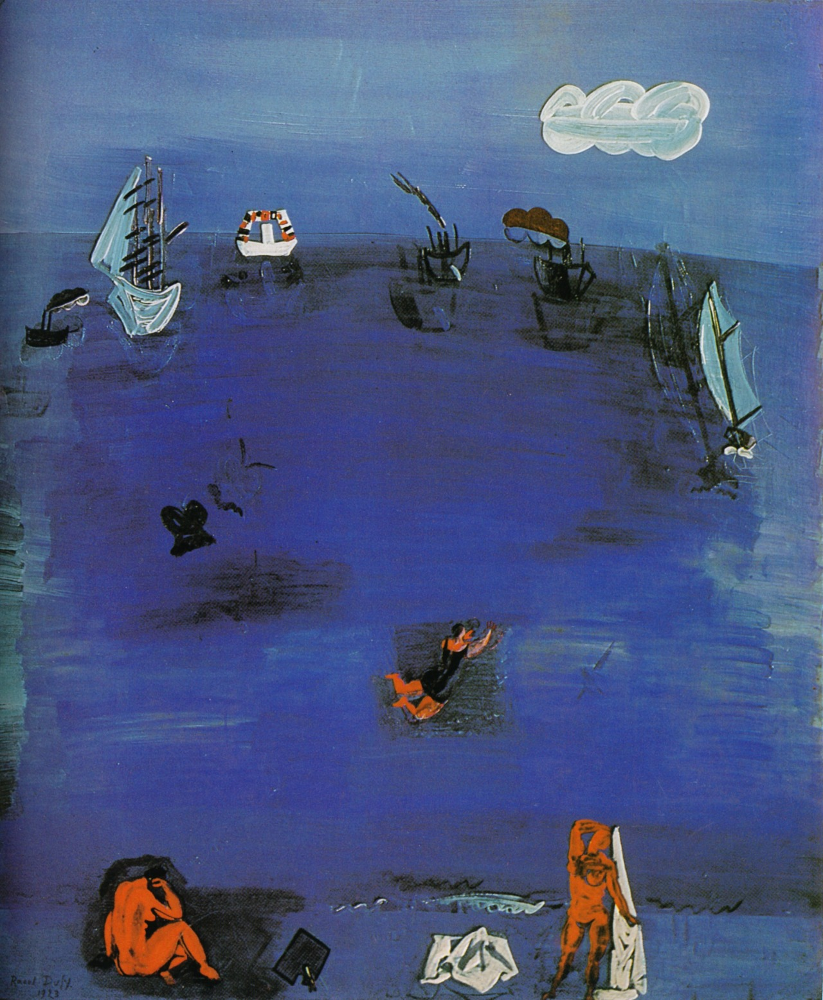

## 基本信息

- 作者：[[杜菲 Raoul Dufy]]
- 创作年代：1923
- 材质：油彩，画布 (*not from wiki*)
- 现存地：(*not from wiki*)

## 画面与技法

[[杜菲 Raoul Dufy]] 1923 年作品。顾衡 063 把本作作为杜菲**原始性+装饰性**风格的样本：

> 杜菲用浓浓的原始风，创造出了一个梦幻般的世界。今天，我们看这样的作品或许觉得并不稀奇，但是当我们沿着欧洲艺术史的小径一路走来，就能理解这第一步，是多么的石破天惊。

杜菲对 [[野兽派 Fauvism]] 本质的把握，被顾衡 063 总结为一句话：

> **按照原始人的画法，把画画得好看就得了。**

他不像 [[弗拉芒克 Maurice de Vlaminck]] 那样激进，反而**迅速抓住了野兽派的本质——原始性和装饰性**。

## 历史背景 (*not from wiki*)

- 1920 年代 [[杜菲 Raoul Dufy]] 已发展出稳定的"杜菲式装饰画风"——明快薄涂底色 + 原始式简率线条。
- 同期他与服装设计师 Paul Poiret 合作开发印花纺织，把这套装饰美学从画布扩展到面料。

## 图片清单

| 编号 | 出自 | 描述 |
|---|---|---|
| 01 | [[063｜野兽派，除了马蒂斯还能谈什么？]] | 整幅画面——杜菲的"原始风梦幻世界" |

## 出现在

- [[063｜野兽派，除了马蒂斯还能谈什么？]] —— 杜菲原始性+装饰性的核心样本
