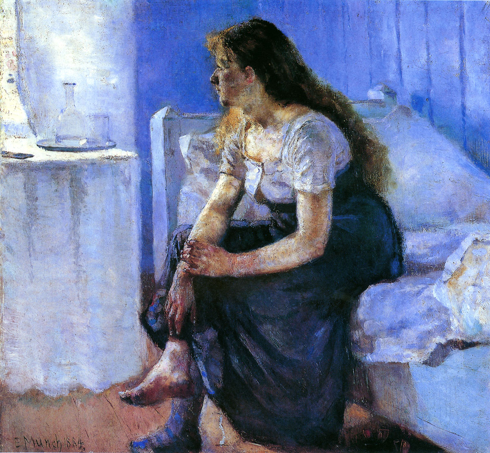

## 基本信息

- 作者：[[爱德华·蒙克 Edvard Munch]]
- 创作年代：1894
- 材质：布面油画 (*not from wiki*)
- 尺寸：未注明
- 现存地：未注明

## 画面与技法

与 [[点炉火的女孩儿 Girl Kindling a Stove]] 同列于蒙克早期—— **现实主义倾向**，有点儿 [[库尔贝 Gustave Courbet]] / [[马奈 Édouard Manet]] 味道（顾衡 070）。

## 历史背景 (*not from wiki*)

注：顾衡 070 raw 中给出年代为 1894，但本作另有 1883 版本（蒙克常重画同一母题）——以课程版本为准。

## 图片清单

| 编号 | 出自 | 描述 |
|---|---|---|
| 01 | [[070｜蒙克1：表现主义的先行者经历了什么？]] | 女孩侧坐床沿 |

## 出现在

- [[070｜蒙克1：表现主义的先行者经历了什么？]]
