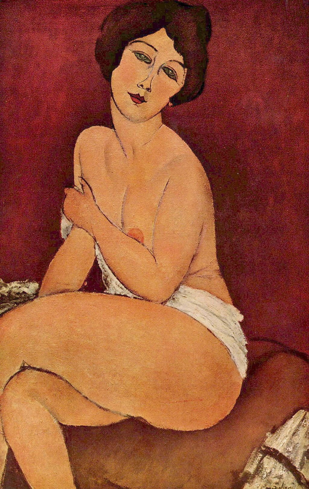

## 基本信息

- 作者：[[莫迪里阿尼 Amedeo Modigliani]]
- 创作年代：1917
- 材质：布面油画 (*not from wiki*)
- 尺寸：(*未知*)
- 现存地：(*未知*)

## 画面与技法

[[莫迪里阿尼 Amedeo Modigliani]] 1917 年裸体画系列中的一件。顾衡 078 将这一组（[[坐在沙发毯上的裸女 (莫迪里阿尼) Nude Sitting on Divan Throw Blanket]]、[[坐着的裸女 (莫迪里阿尼) Seated Nude (Modigliani)]]、[[戴项链坐着的裸女 (莫迪里阿尼) Seated Nude with Necklace]]）共同作为"**没有个人特征、高度程式化**"的范本——画的是"女人"而非"某一个特定的女人"。

## 历史背景 (*not from wiki*)

属 1917 年 Berthe Weill 画廊个展系列；该展览开幕即被警方因"淫秽"勒令撤展。

## 图片清单

| 编号 | 出自 | 描述 |
|---|---|---|
| 01 | [[078｜莫迪里阿尼：画中女子为什么让人一眼难忘？]] | 坐姿裸女 |

## 出现在

- [[078｜莫迪里阿尼：画中女子为什么让人一眼难忘？]]
